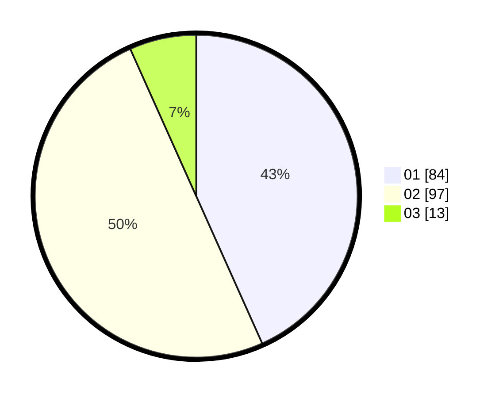

# Hasil

Hasil perolehan suara paslon dapat dilihat pada file paslon-01.txt, paslon-02.txt, dan paslon-03.txt.

Jika tidak ada, artinya data tersebut belum ada pada SIREKAP.

## Perolehan Suara

 * Paslon 01: **84**.
 * Paslon 02: **97**.
 * Paslon 03: **13**.

## Foto C Plano

https://sirekap-obj-formc.kpu.go.id/5bed/pemilu/ppwp/31/71/08/10/01/3171081001015-20240216-151916--9fdd3c8e-1716-4938-9abb-3e8c572d018a.jpg

https://sirekap-obj-formc.kpu.go.id/5bed/pemilu/ppwp/31/71/08/10/01/3171081001015-20240216-151917--cf7fe39c-ab7e-47d3-a2f9-e0b507bc0dc2.jpg

https://sirekap-obj-formc.kpu.go.id/5bed/pemilu/ppwp/31/71/08/10/01/3171081001015-20240216-151916--fec378c1-5100-4bec-8c9c-a1cd163a9150.jpg

## DATA PEMILIH TETAP

Jumlah pemilih dalam DPT: **258**.
 * L: **127**.
 * P: **131**.

## DATA PENGGUNA HAK PILIH

Jumlah pengguna hak pilih dalam DPT: **194**.
 * L: **90**.
 * P: **104**.

Jumlah pengguna hak pilih dalam DPTb: **0**.
 * L: **0**.
 * P: **0**.

Jumlah pengguna hak pilih dalam DPK: **4**.
 * L: **0**.
 * P: **4**.

Jumlah pengguna hak pilih: **198**.
 * L: **90**.
 * P: **108**.

## JUMLAH SUARA SAH DAN TIDAK SAH

JUMLAH SELURUH SUARA SAH: **194**.

JUMLAH SUARA TIDAK SAH: **4**.

JUMLAH SELURUH SUARA SAH DAN SUARA TIDAK SAH: **198**.
