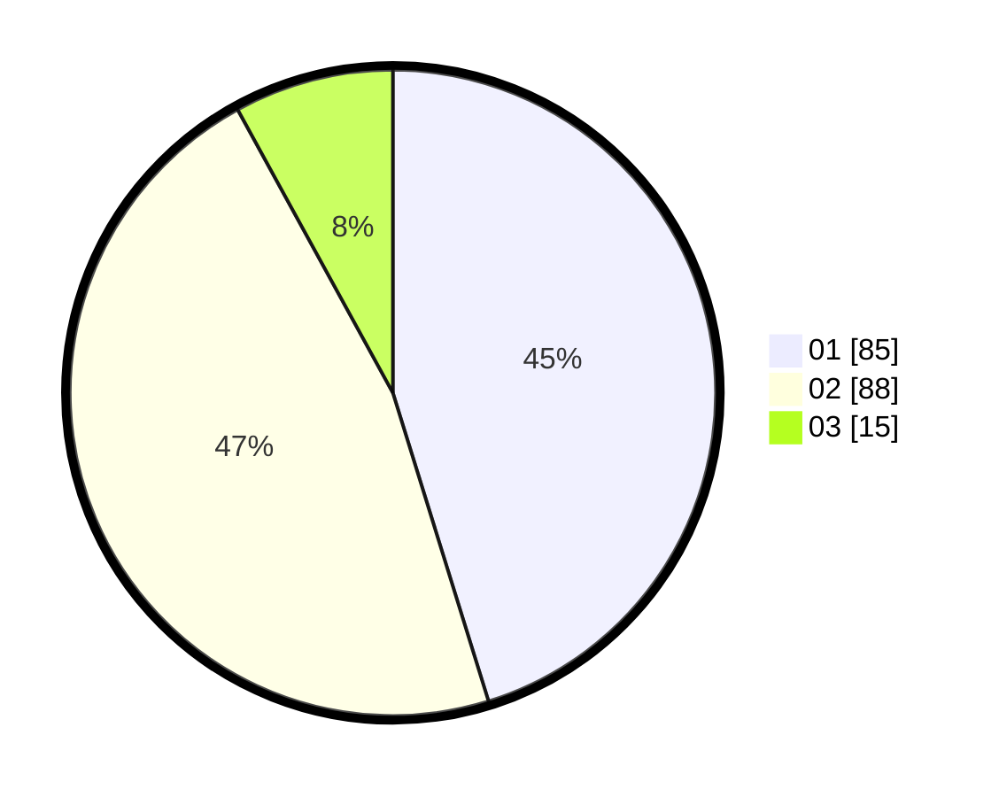

# Hasil

Hasil perolehan suara paslon dapat dilihat pada file paslon-01.txt, paslon-02.txt, dan paslon-03.txt.

Jika tidak ada, artinya data tersebut belum ada pada SIREKAP.

## Perolehan Suara

 * Paslon 01: **85**.
 * Paslon 02: **88**.
 * Paslon 03: **15**.

## Foto C Plano

https://sirekap-obj-formc.kpu.go.id/1b5a/pemilu/ppwp/31/71/08/10/01/3171081001017-20240216-050528--601a7e88-7219-4c2b-b454-f4ea25e4a2d8.jpg

https://sirekap-obj-formc.kpu.go.id/1b5a/pemilu/ppwp/31/71/08/10/01/3171081001017-20240216-050529--9f8579db-d4a4-4568-b84f-1571d81a1939.jpg

https://sirekap-obj-formc.kpu.go.id/1b5a/pemilu/ppwp/31/71/08/10/01/3171081001017-20240216-011531--792ebe58-f9c5-4c5f-843a-fcf489cb6b97.jpg

## DATA PEMILIH TETAP

Jumlah pemilih dalam DPT: **263**.
 * L: **124**.
 * P: **139**.

## DATA PENGGUNA HAK PILIH

Jumlah pengguna hak pilih dalam DPT: **191**.
 * L: **89**.
 * P: **102**.

Jumlah pengguna hak pilih dalam DPTb: **0**.
 * L: **0**.
 * P: **0**.

Jumlah pengguna hak pilih dalam DPK: **0**.
 * L: **0**.
 * P: **0**.

Jumlah pengguna hak pilih: **191**.
 * L: **89**.
 * P: **102**.

## JUMLAH SUARA SAH DAN TIDAK SAH

JUMLAH SELURUH SUARA SAH: **188**.

JUMLAH SUARA TIDAK SAH: **3**.

JUMLAH SELURUH SUARA SAH DAN SUARA TIDAK SAH: **191**.
