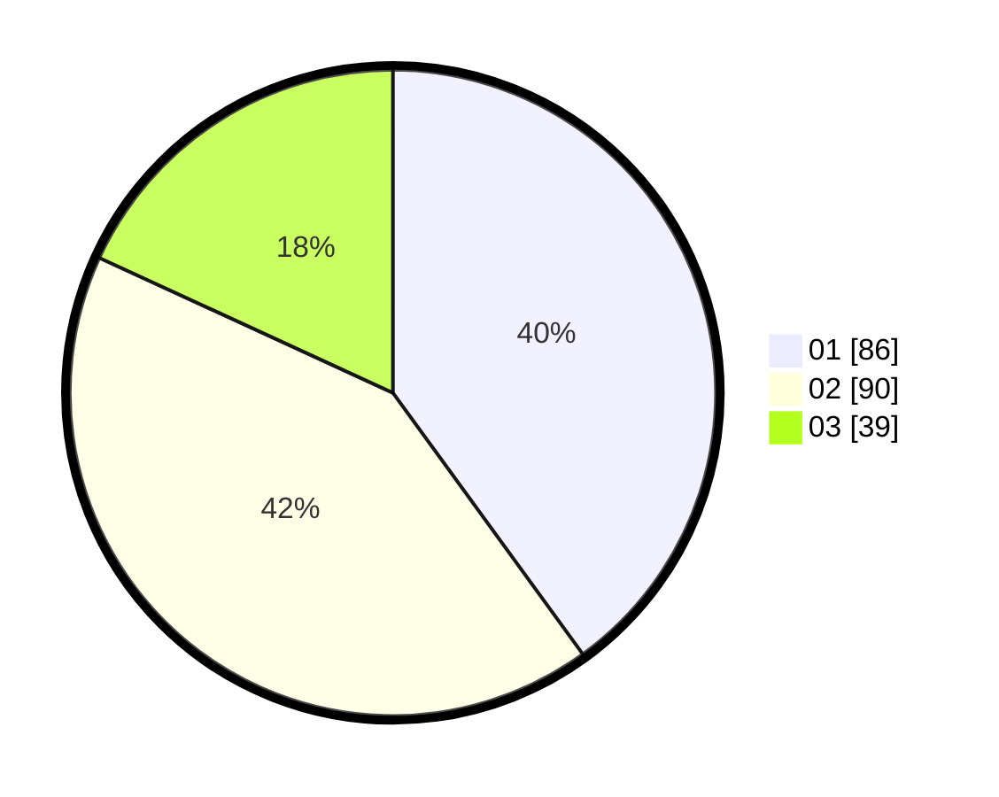

# Hasil

Hasil perolehan suara paslon dapat dilihat pada file paslon-01.txt, paslon-02.txt, dan paslon-03.txt.

Jika tidak ada, artinya data tersebut belum ada pada SIREKAP.

## Perolehan Suara

 * Paslon 01: **86**.
 * Paslon 02: **90**.
 * Paslon 03: **39**.

## Foto C Plano

https://sirekap-obj-formc.kpu.go.id/a9ed/pemilu/ppwp/31/71/08/10/01/3171081001024-20240216-132948--ef298248-f5c1-4c69-82da-2f542c07ac85.jpg

https://sirekap-obj-formc.kpu.go.id/a9ed/pemilu/ppwp/31/71/08/10/01/3171081001024-20240216-132949--b20861de-9f9e-4e79-8cfb-043a157b3f23.jpg

https://sirekap-obj-formc.kpu.go.id/a9ed/pemilu/ppwp/31/71/08/10/01/3171081001024-20240216-132949--a12f0e26-9dce-4434-aa6a-7550496a02f9.jpg

## DATA PEMILIH TETAP

Jumlah pemilih dalam DPT: **278**.
 * L: **137**.
 * P: **141**.

## DATA PENGGUNA HAK PILIH

Jumlah pengguna hak pilih dalam DPT: **220**.
 * L: **105**.
 * P: **115**.

Jumlah pengguna hak pilih dalam DPTb: **0**.
 * L: **0**.
 * P: **0**.

Jumlah pengguna hak pilih dalam DPK: **1**.
 * L: **1**.
 * P: **0**.

Jumlah pengguna hak pilih: **221**.
 * L: **106**.
 * P: **115**.

## JUMLAH SUARA SAH DAN TIDAK SAH

JUMLAH SELURUH SUARA SAH: **215**.

JUMLAH SUARA TIDAK SAH: **6**.

JUMLAH SELURUH SUARA SAH DAN SUARA TIDAK SAH: **221**.
