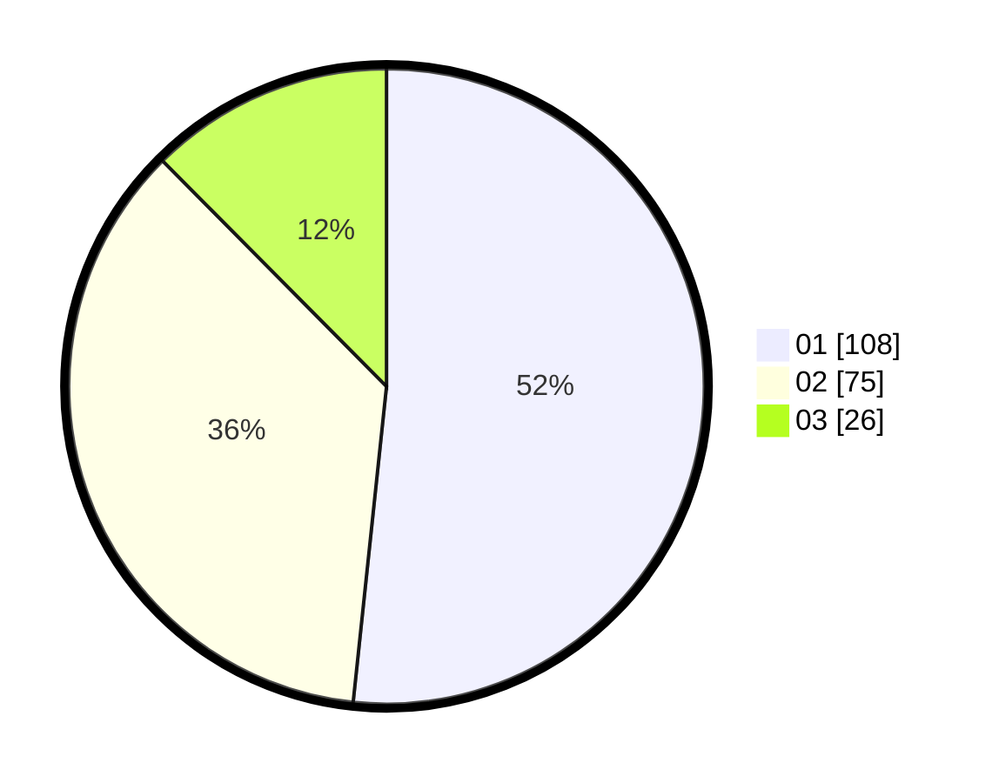

# Hasil

Hasil perolehan suara paslon dapat dilihat pada file paslon-01.txt, paslon-02.txt, dan paslon-03.txt.

Jika tidak ada, artinya data tersebut belum ada pada SIREKAP.

## Perolehan Suara

 * Paslon 01: **108**.
 * Paslon 02: **75**.
 * Paslon 03: **26**.

## Foto C Plano

https://sirekap-obj-formc.kpu.go.id/31ad/pemilu/ppwp/31/71/08/10/01/3171081001025-20240216-151310--f3c1e9aa-46e0-4ad3-aa98-c2d5e1cb3206.jpg

https://sirekap-obj-formc.kpu.go.id/31ad/pemilu/ppwp/31/71/08/10/01/3171081001025-20240216-151311--67667c47-f804-495a-9c05-ea19e58d776b.jpg

https://sirekap-obj-formc.kpu.go.id/31ad/pemilu/ppwp/31/71/08/10/01/3171081001025-20240216-151311--c3de80c5-6ea8-4f68-8ab6-0cfc1751b3a5.jpg

## DATA PEMILIH TETAP

Jumlah pemilih dalam DPT: **278**.
 * L: **155**.
 * P: **123**.

## DATA PENGGUNA HAK PILIH

Jumlah pengguna hak pilih dalam DPT: **209**.
 * L: **119**.
 * P: **90**.

Jumlah pengguna hak pilih dalam DPTb: **0**.
 * L: **0**.
 * P: **0**.

Jumlah pengguna hak pilih dalam DPK: **2**.
 * L: **2**.
 * P: **0**.

Jumlah pengguna hak pilih: **211**.
 * L: **121**.
 * P: **90**.

## JUMLAH SUARA SAH DAN TIDAK SAH

JUMLAH SELURUH SUARA SAH: **211**.

JUMLAH SUARA TIDAK SAH: **0**.

JUMLAH SELURUH SUARA SAH DAN SUARA TIDAK SAH: **211**.
