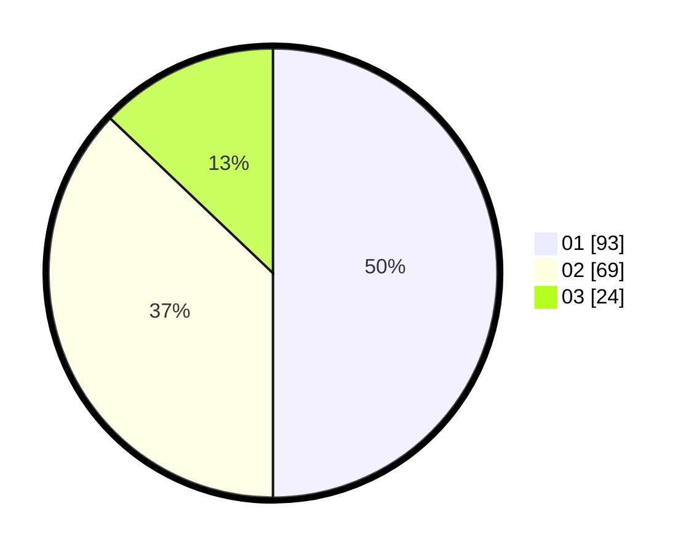

# Hasil

Hasil perolehan suara paslon dapat dilihat pada file paslon-01.txt, paslon-02.txt, dan paslon-03.txt.

Jika tidak ada, artinya data tersebut belum ada pada SIREKAP.

## Perolehan Suara

 * Paslon 01: **93**.
 * Paslon 02: **69**.
 * Paslon 03: **24**.

## Foto C Plano

https://sirekap-obj-formc.kpu.go.id/ad84/pemilu/ppwp/31/71/08/10/01/3171081001026-20240216-150054--33253f2f-3a79-4be5-b8aa-3cba8a90c02d.jpg

https://sirekap-obj-formc.kpu.go.id/ad84/pemilu/ppwp/31/71/08/10/01/3171081001026-20240216-150055--3bc4d0b7-d485-4856-aacc-96c0d48571c2.jpg

https://sirekap-obj-formc.kpu.go.id/ad84/pemilu/ppwp/31/71/08/10/01/3171081001026-20240216-150055--f42d6b0f-4055-4cb9-bdf5-9c0ac6c52088.jpg

## DATA PEMILIH TETAP

Jumlah pemilih dalam DPT: **276**.
 * L: **146**.
 * P: **130**.

## DATA PENGGUNA HAK PILIH

Jumlah pengguna hak pilih dalam DPT: **185**.
 * L: **92**.
 * P: **93**.

Jumlah pengguna hak pilih dalam DPTb: **2**.
 * L: **2**.
 * P: **0**.

Jumlah pengguna hak pilih dalam DPK: **0**.
 * L: **0**.
 * P: **0**.

Jumlah pengguna hak pilih: **187**.
 * L: **94**.
 * P: **93**.

## JUMLAH SUARA SAH DAN TIDAK SAH

JUMLAH SELURUH SUARA SAH: **186**.

JUMLAH SUARA TIDAK SAH: **1**.

JUMLAH SELURUH SUARA SAH DAN SUARA TIDAK SAH: **187**.
