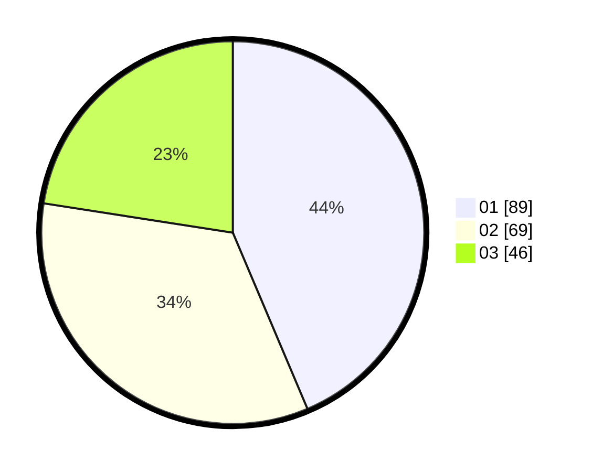

# Hasil

Hasil perolehan suara paslon dapat dilihat pada file paslon-01.txt, paslon-02.txt, dan paslon-03.txt.

Jika tidak ada, artinya data tersebut belum ada pada SIREKAP.

## Perolehan Suara

 * Paslon 01: **89**.
 * Paslon 02: **69**.
 * Paslon 03: **46**.

## Foto C Plano

https://sirekap-obj-formc.kpu.go.id/ceea/pemilu/ppwp/31/71/08/10/01/3171081001032-20240216-161845--2ef3753c-d584-4044-8526-3b05a9b59e21.jpg

https://sirekap-obj-formc.kpu.go.id/ceea/pemilu/ppwp/31/71/08/10/01/3171081001032-20240216-161847--413bb165-fcd2-4988-80a1-948d2e129405.jpg

https://sirekap-obj-formc.kpu.go.id/ceea/pemilu/ppwp/31/71/08/10/01/3171081001032-20240216-161846--251bda82-9700-4840-8b29-1b0913d6f4f4.jpg

## DATA PEMILIH TETAP

Jumlah pemilih dalam DPT: **265**.
 * L: **118**.
 * P: **147**.

## DATA PENGGUNA HAK PILIH

Jumlah pengguna hak pilih dalam DPT: **203**.
 * L: **92**.
 * P: **111**.

Jumlah pengguna hak pilih dalam DPTb: **5**.
 * L: **1**.
 * P: **4**.

Jumlah pengguna hak pilih dalam DPK: **1**.
 * L: **0**.
 * P: **1**.

Jumlah pengguna hak pilih: **209**.
 * L: **93**.
 * P: **116**.

## JUMLAH SUARA SAH DAN TIDAK SAH

JUMLAH SELURUH SUARA SAH: **204**.

JUMLAH SUARA TIDAK SAH: **5**.

JUMLAH SELURUH SUARA SAH DAN SUARA TIDAK SAH: **209**.
