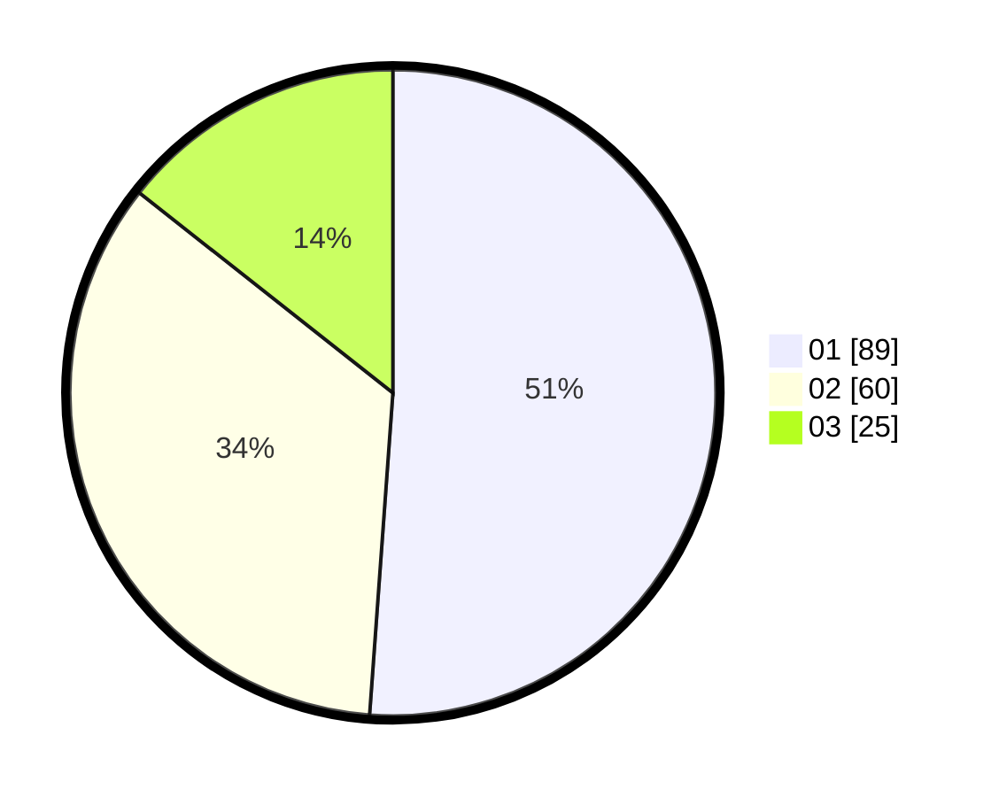

# Hasil

Hasil perolehan suara paslon dapat dilihat pada file paslon-01.txt, paslon-02.txt, dan paslon-03.txt.

Jika tidak ada, artinya data tersebut belum ada pada SIREKAP.

## Perolehan Suara

 * Paslon 01: **89**.
 * Paslon 02: **60**.
 * Paslon 03: **25**.

## Foto C Plano

https://sirekap-obj-formc.kpu.go.id/daa1/pemilu/ppwp/31/71/08/10/01/3171081001033-20240214-195209--0372f1b2-e3a0-4c6f-a744-e404091861a6.jpg

https://sirekap-obj-formc.kpu.go.id/daa1/pemilu/ppwp/31/71/08/10/01/3171081001033-20240214-195415--4a8ab94e-8bab-4e19-98c1-7dc41825c0be.jpg

https://sirekap-obj-formc.kpu.go.id/daa1/pemilu/ppwp/31/71/08/10/01/3171081001033-20240214-195652--42719c16-4d6c-4b43-bb31-657a1daa4fce.jpg

## DATA PEMILIH TETAP

Jumlah pemilih dalam DPT: **239**.
 * L: **127**.
 * P: **112**.

## DATA PENGGUNA HAK PILIH

Jumlah pengguna hak pilih dalam DPT: **176**.
 * L: **86**.
 * P: **90**.

Jumlah pengguna hak pilih dalam DPTb: **3**.
 * L: **1**.
 * P: **2**.

Jumlah pengguna hak pilih dalam DPK: **0**.
 * L: **0**.
 * P: **0**.

Jumlah pengguna hak pilih: **179**.
 * L: **87**.
 * P: **92**.

## JUMLAH SUARA SAH DAN TIDAK SAH

JUMLAH SELURUH SUARA SAH: **174**.

JUMLAH SUARA TIDAK SAH: **5**.

JUMLAH SELURUH SUARA SAH DAN SUARA TIDAK SAH: **179**.
