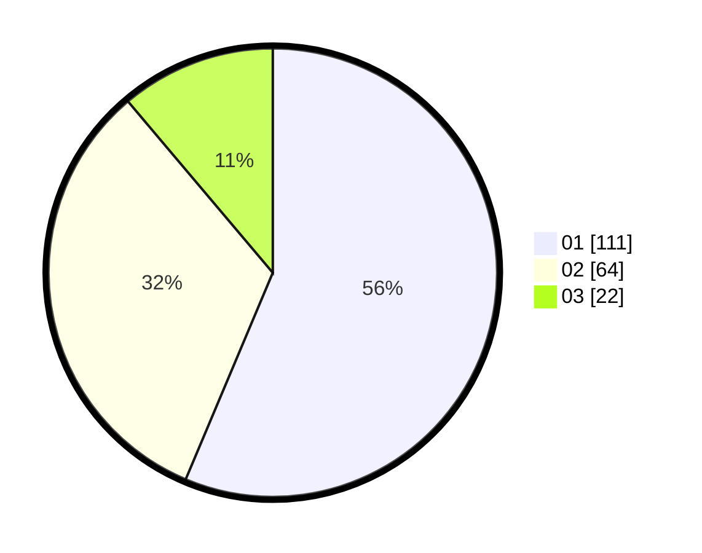

# Hasil

Hasil perolehan suara paslon dapat dilihat pada file paslon-01.txt, paslon-02.txt, dan paslon-03.txt.

Jika tidak ada, artinya data tersebut belum ada pada SIREKAP.

## Perolehan Suara

 * Paslon 01: **111**.
 * Paslon 02: **64**.
 * Paslon 03: **22**.

## Foto C Plano

https://sirekap-obj-formc.kpu.go.id/95f9/pemilu/ppwp/31/71/08/10/01/3171081001035-20240216-150912--c3fb158a-2f77-459d-b4b1-a559783ba544.jpg

https://sirekap-obj-formc.kpu.go.id/95f9/pemilu/ppwp/31/71/08/10/01/3171081001035-20240214-191934--5e3de32d-19b2-4c3d-abed-f7cf8a27f4e4.jpg

https://sirekap-obj-formc.kpu.go.id/95f9/pemilu/ppwp/31/71/08/10/01/3171081001035-20240216-150913--4b922855-81b6-4bc0-b314-e0f7fed90cc2.jpg

## DATA PEMILIH TETAP

Jumlah pemilih dalam DPT: **265**.
 * L: **128**.
 * P: **137**.

## DATA PENGGUNA HAK PILIH

Jumlah pengguna hak pilih dalam DPT: **196**.
 * L: **96**.
 * P: **100**.

Jumlah pengguna hak pilih dalam DPTb: **0**.
 * L: **0**.
 * P: **0**.

Jumlah pengguna hak pilih dalam DPK: **4**.
 * L: **2**.
 * P: **2**.

Jumlah pengguna hak pilih: **200**.
 * L: **98**.
 * P: **102**.

## JUMLAH SUARA SAH DAN TIDAK SAH

JUMLAH SELURUH SUARA SAH: **197**.

JUMLAH SUARA TIDAK SAH: **3**.

JUMLAH SELURUH SUARA SAH DAN SUARA TIDAK SAH: **200**.
