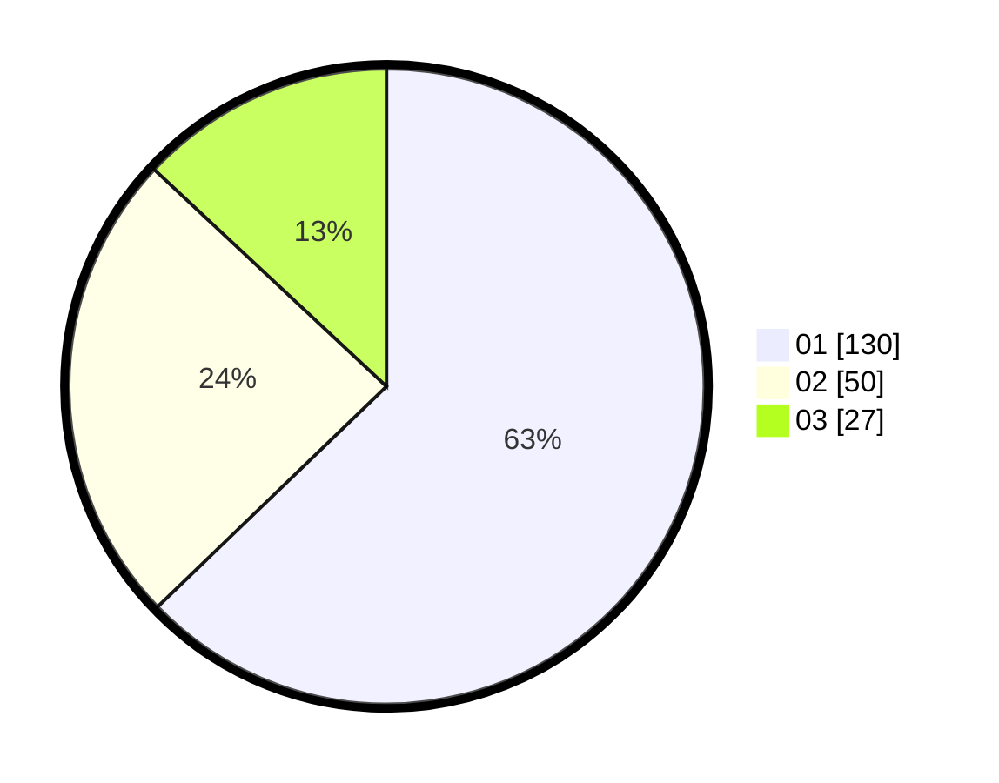

# Hasil

Hasil perolehan suara paslon dapat dilihat pada file paslon-01.txt, paslon-02.txt, dan paslon-03.txt.

Jika tidak ada, artinya data tersebut belum ada pada SIREKAP.

## Perolehan Suara

 * Paslon 01: **130**.
 * Paslon 02: **50**.
 * Paslon 03: **27**.

## Foto C Plano

https://sirekap-obj-formc.kpu.go.id/869a/pemilu/ppwp/31/71/08/10/01/3171081001036-20240216-152209--2d083035-4b69-40b2-812c-dcb515379962.jpg

https://sirekap-obj-formc.kpu.go.id/869a/pemilu/ppwp/31/71/08/10/01/3171081001036-20240216-152210--b031db04-a61e-4822-856d-04bcd41272ee.jpg

https://sirekap-obj-formc.kpu.go.id/869a/pemilu/ppwp/31/71/08/10/01/3171081001036-20240216-152209--d30125c4-24f7-4cf1-af45-d720a46eb550.jpg

## DATA PEMILIH TETAP

Jumlah pemilih dalam DPT: **268**.
 * L: **129**.
 * P: **139**.

## DATA PENGGUNA HAK PILIH

Jumlah pengguna hak pilih dalam DPT: **205**.
 * L: **93**.
 * P: **112**.

Jumlah pengguna hak pilih dalam DPTb: **4**.
 * L: **0**.
 * P: **4**.

Jumlah pengguna hak pilih dalam DPK: **2**.
 * L: **1**.
 * P: **1**.

Jumlah pengguna hak pilih: **211**.
 * L: **94**.
 * P: **117**.

## JUMLAH SUARA SAH DAN TIDAK SAH

JUMLAH SELURUH SUARA SAH: **207**.

JUMLAH SUARA TIDAK SAH: **4**.

JUMLAH SELURUH SUARA SAH DAN SUARA TIDAK SAH: **211**.
