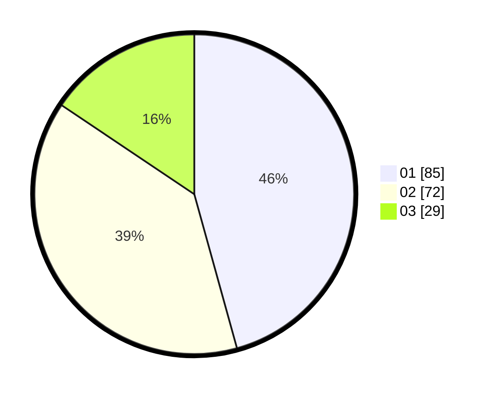

# Hasil

Hasil perolehan suara paslon dapat dilihat pada file paslon-01.txt, paslon-02.txt, dan paslon-03.txt.

Jika tidak ada, artinya data tersebut belum ada pada SIREKAP.

## Perolehan Suara

 * Paslon 01: **85**.
 * Paslon 02: **72**.
 * Paslon 03: **29**.

## Foto C Plano

https://sirekap-obj-formc.kpu.go.id/a298/pemilu/ppwp/31/71/08/10/01/3171081001039-20240216-160256--6d304df0-bacf-4843-8aff-7c2c9f91baf3.jpg

https://sirekap-obj-formc.kpu.go.id/a298/pemilu/ppwp/31/71/08/10/01/3171081001039-20240216-160258--93f7b98e-f092-48ef-bd9c-627378de2fb8.jpg

https://sirekap-obj-formc.kpu.go.id/a298/pemilu/ppwp/31/71/08/10/01/3171081001039-20240216-160257--49a17525-c420-427f-992e-899b4c663802.jpg

## DATA PEMILIH TETAP

Jumlah pemilih dalam DPT: **266**.
 * L: **135**.
 * P: **131**.

## DATA PENGGUNA HAK PILIH

Jumlah pengguna hak pilih dalam DPT: **186**.
 * L: **94**.
 * P: **92**.

Jumlah pengguna hak pilih dalam DPTb: **6**.
 * L: **4**.
 * P: **2**.

Jumlah pengguna hak pilih dalam DPK: **1**.
 * L: **1**.
 * P: **0**.

Jumlah pengguna hak pilih: **193**.
 * L: **99**.
 * P: **94**.

## JUMLAH SUARA SAH DAN TIDAK SAH

JUMLAH SELURUH SUARA SAH: **186**.

JUMLAH SUARA TIDAK SAH: **7**.

JUMLAH SELURUH SUARA SAH DAN SUARA TIDAK SAH: **193**.
