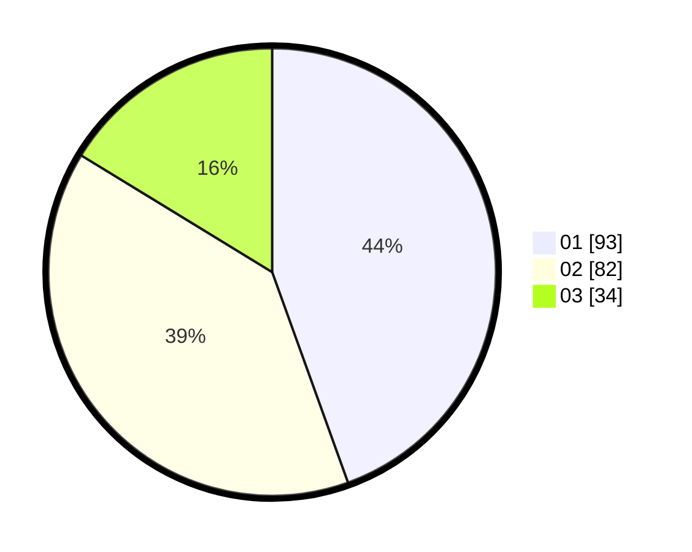

# Hasil

Hasil perolehan suara paslon dapat dilihat pada file paslon-01.txt, paslon-02.txt, dan paslon-03.txt.

Jika tidak ada, artinya data tersebut belum ada pada SIREKAP.

## Perolehan Suara

 * Paslon 01: **93**.
 * Paslon 02: **82**.
 * Paslon 03: **34**.

## Foto C Plano

https://sirekap-obj-formc.kpu.go.id/0d3e/pemilu/ppwp/31/71/08/10/01/3171081001040-20240214-221349--de167c78-f03b-4cfe-a651-bbbacee3cb39.jpg

https://sirekap-obj-formc.kpu.go.id/0d3e/pemilu/ppwp/31/71/08/10/01/3171081001040-20240214-221410--bfd5c185-867d-4000-bae8-cc23b3d3d75c.jpg

https://sirekap-obj-formc.kpu.go.id/0d3e/pemilu/ppwp/31/71/08/10/01/3171081001040-20240214-221400--50634da4-d701-427e-ad08-174f03243c8a.jpg

## DATA PEMILIH TETAP

Jumlah pemilih dalam DPT: **272**.
 * L: **122**.
 * P: **150**.

## DATA PENGGUNA HAK PILIH

Jumlah pengguna hak pilih dalam DPT: **203**.
 * L: **91**.
 * P: **112**.

Jumlah pengguna hak pilih dalam DPTb: **4**.
 * L: **3**.
 * P: **1**.

Jumlah pengguna hak pilih dalam DPK: **10**.
 * L: **4**.
 * P: **6**.

Jumlah pengguna hak pilih: **217**.
 * L: **98**.
 * P: **119**.

## JUMLAH SUARA SAH DAN TIDAK SAH

JUMLAH SELURUH SUARA SAH: **209**.

JUMLAH SUARA TIDAK SAH: **8**.

JUMLAH SELURUH SUARA SAH DAN SUARA TIDAK SAH: **217**.
