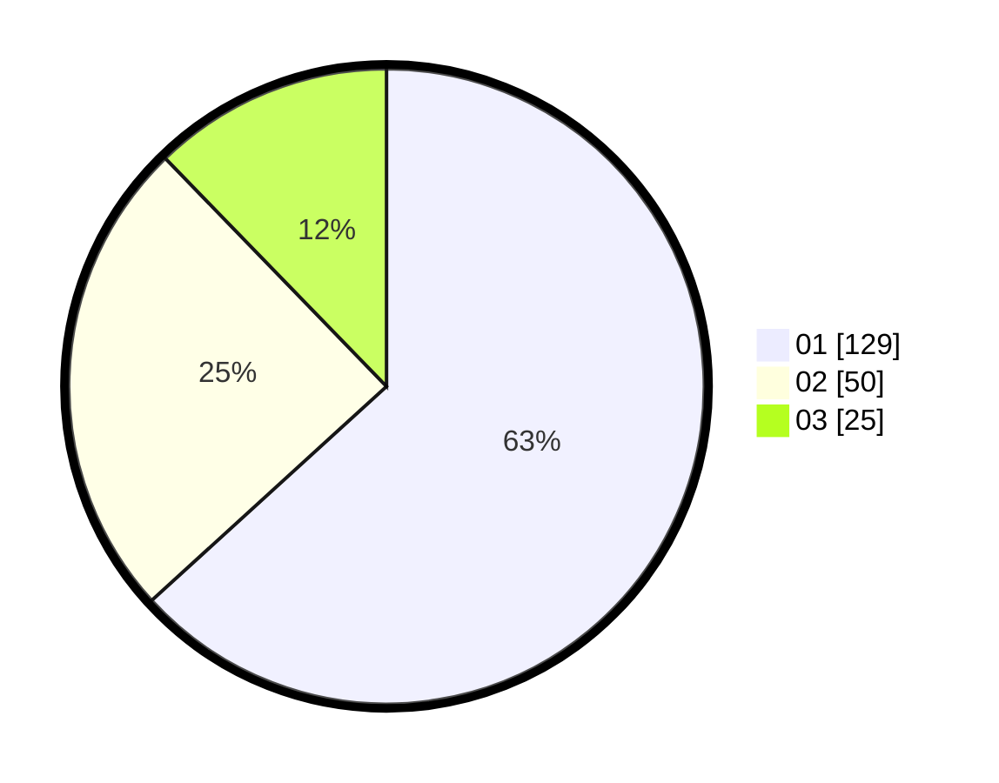

# Hasil

Hasil perolehan suara paslon dapat dilihat pada file paslon-01.txt, paslon-02.txt, dan paslon-03.txt.

Jika tidak ada, artinya data tersebut belum ada pada SIREKAP.

## Perolehan Suara

 * Paslon 01: **129**.
 * Paslon 02: **50**.
 * Paslon 03: **25**.

## Foto C Plano

https://sirekap-obj-formc.kpu.go.id/3aaf/pemilu/ppwp/31/71/08/10/01/3171081001042-20240216-151414--8e28a8a9-ad85-4930-b6df-8e72222aded1.jpg

https://sirekap-obj-formc.kpu.go.id/3aaf/pemilu/ppwp/31/71/08/10/01/3171081001042-20240216-151416--5fa95983-40d0-424c-b086-d4b3548af5e4.jpg

https://sirekap-obj-formc.kpu.go.id/3aaf/pemilu/ppwp/31/71/08/10/01/3171081001042-20240216-151415--da489ee2-cb25-41b7-b472-d5ff1f81263c.jpg

## DATA PEMILIH TETAP

Jumlah pemilih dalam DPT: **271**.
 * L: **135**.
 * P: **136**.

## DATA PENGGUNA HAK PILIH

Jumlah pengguna hak pilih dalam DPT: **203**.
 * L: **96**.
 * P: **107**.

Jumlah pengguna hak pilih dalam DPTb: **0**.
 * L: **0**.
 * P: **0**.

Jumlah pengguna hak pilih dalam DPK: **4**.
 * L: **1**.
 * P: **3**.

Jumlah pengguna hak pilih: **207**.
 * L: **97**.
 * P: **110**.

## JUMLAH SUARA SAH DAN TIDAK SAH

JUMLAH SELURUH SUARA SAH: **204**.

JUMLAH SUARA TIDAK SAH: **3**.

JUMLAH SELURUH SUARA SAH DAN SUARA TIDAK SAH: **207**.
