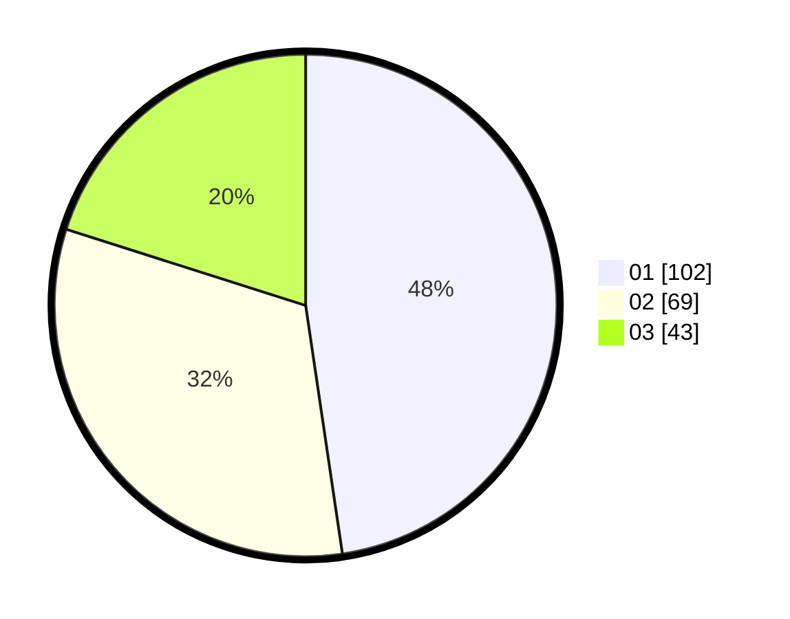

# Hasil

Hasil perolehan suara paslon dapat dilihat pada file paslon-01.txt, paslon-02.txt, dan paslon-03.txt.

Jika tidak ada, artinya data tersebut belum ada pada SIREKAP.

## Perolehan Suara

 * Paslon 01: **102**.
 * Paslon 02: **69**.
 * Paslon 03: **43**.

## Foto C Plano

https://sirekap-obj-formc.kpu.go.id/d082/pemilu/ppwp/31/71/08/10/01/3171081001046-20240216-152403--066180e2-3d8c-4818-ad92-27a13f07ac23.jpg

https://sirekap-obj-formc.kpu.go.id/d082/pemilu/ppwp/31/71/08/10/01/3171081001046-20240216-152404--9d14fa69-10e9-4331-a596-df7fcfed9535.jpg

https://sirekap-obj-formc.kpu.go.id/d082/pemilu/ppwp/31/71/08/10/01/3171081001046-20240216-152403--6adaeabd-41a1-4b26-99f1-5d4bfef40327.jpg

## DATA PEMILIH TETAP

Jumlah pemilih dalam DPT: **250**.
 * L: **125**.
 * P: **125**.

## DATA PENGGUNA HAK PILIH

Jumlah pengguna hak pilih dalam DPT: **209**.
 * L: **100**.
 * P: **109**.

Jumlah pengguna hak pilih dalam DPTb: **7**.
 * L: **3**.
 * P: **4**.

Jumlah pengguna hak pilih dalam DPK: **2**.
 * L: **2**.
 * P: **0**.

Jumlah pengguna hak pilih: **218**.
 * L: **105**.
 * P: **113**.

## JUMLAH SUARA SAH DAN TIDAK SAH

JUMLAH SELURUH SUARA SAH: **214**.

JUMLAH SUARA TIDAK SAH: **4**.

JUMLAH SELURUH SUARA SAH DAN SUARA TIDAK SAH: **218**.
