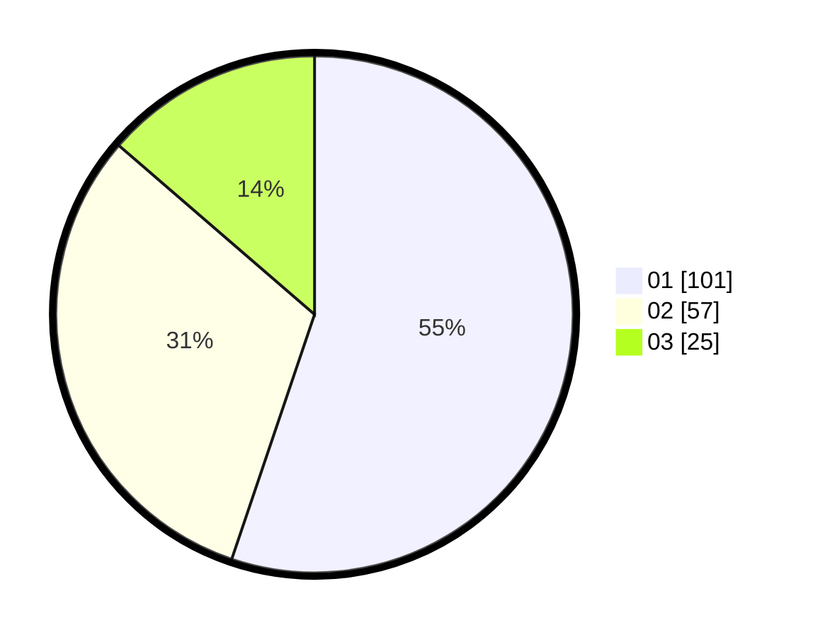

# Hasil

Hasil perolehan suara paslon dapat dilihat pada file paslon-01.txt, paslon-02.txt, dan paslon-03.txt.

Jika tidak ada, artinya data tersebut belum ada pada SIREKAP.

## Perolehan Suara

 * Paslon 01: **101**.
 * Paslon 02: **57**.
 * Paslon 03: **25**.

## Foto C Plano

https://sirekap-obj-formc.kpu.go.id/a895/pemilu/ppwp/31/71/08/10/01/3171081001047-20240214-185459--9a6d4147-a160-4e58-985c-0cc8acfe01c1.jpg

https://sirekap-obj-formc.kpu.go.id/a895/pemilu/ppwp/31/71/08/10/01/3171081001047-20240214-184959--cc5475e6-a2fd-4cf8-9224-50f75b8c4052.jpg

https://sirekap-obj-formc.kpu.go.id/a895/pemilu/ppwp/31/71/08/10/01/3171081001047-20240214-184530--bbebf23a-fb57-42b4-b48c-b6b9e021a749.jpg

## DATA PEMILIH TETAP

Jumlah pemilih dalam DPT: **260**.
 * L: **120**.
 * P: **140**.

## DATA PENGGUNA HAK PILIH

Jumlah pengguna hak pilih dalam DPT: **179**.
 * L: **76**.
 * P: **103**.

Jumlah pengguna hak pilih dalam DPTb: **5**.
 * L: **2**.
 * P: **3**.

Jumlah pengguna hak pilih dalam DPK: **0**.
 * L: **0**.
 * P: **0**.

Jumlah pengguna hak pilih: **184**.
 * L: **78**.
 * P: **106**.

## JUMLAH SUARA SAH DAN TIDAK SAH

JUMLAH SELURUH SUARA SAH: **183**.

JUMLAH SUARA TIDAK SAH: **1**.

JUMLAH SELURUH SUARA SAH DAN SUARA TIDAK SAH: **184**.
