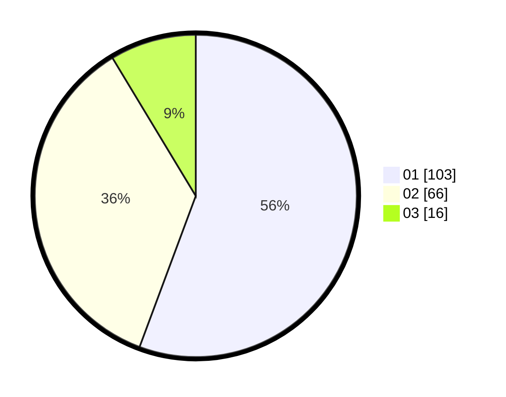

# Hasil

Hasil perolehan suara paslon dapat dilihat pada file paslon-01.txt, paslon-02.txt, dan paslon-03.txt.

Jika tidak ada, artinya data tersebut belum ada pada SIREKAP.

## Perolehan Suara

 * Paslon 01: **103**.
 * Paslon 02: **66**.
 * Paslon 03: **16**.

## Foto C Plano

https://sirekap-obj-formc.kpu.go.id/80ab/pemilu/ppwp/31/71/08/10/01/3171081001053-20240216-162102--59dc752d-d90d-4129-a252-11881e46e66a.jpg

https://sirekap-obj-formc.kpu.go.id/80ab/pemilu/ppwp/31/71/08/10/01/3171081001053-20240216-162103--30f87893-ca7c-4cdd-9817-50e7797029dc.jpg

https://sirekap-obj-formc.kpu.go.id/80ab/pemilu/ppwp/31/71/08/10/01/3171081001053-20240216-162102--dadd34a0-96a2-422d-9532-c787ac14eb95.jpg

## DATA PEMILIH TETAP

Jumlah pemilih dalam DPT: **243**.
 * L: **116**.
 * P: **127**.

## DATA PENGGUNA HAK PILIH

Jumlah pengguna hak pilih dalam DPT: **186**.
 * L: **91**.
 * P: **95**.

Jumlah pengguna hak pilih dalam DPTb: **0**.
 * L: **0**.
 * P: **0**.

Jumlah pengguna hak pilih dalam DPK: **0**.
 * L: **0**.
 * P: **0**.

Jumlah pengguna hak pilih: **186**.
 * L: **91**.
 * P: **95**.

## JUMLAH SUARA SAH DAN TIDAK SAH

JUMLAH SELURUH SUARA SAH: **185**.

JUMLAH SUARA TIDAK SAH: **1**.

JUMLAH SELURUH SUARA SAH DAN SUARA TIDAK SAH: **186**.
