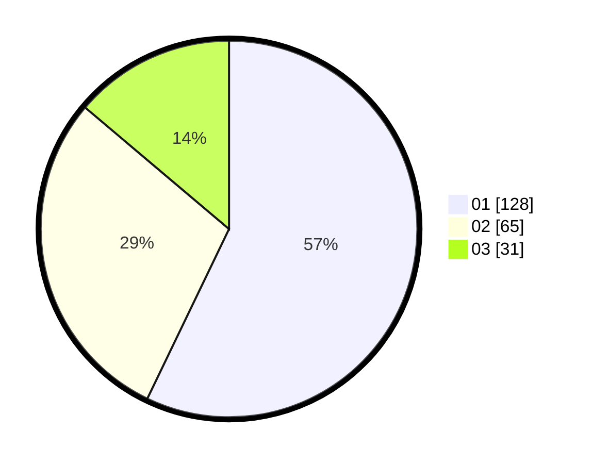

# Hasil

Hasil perolehan suara paslon dapat dilihat pada file paslon-01.txt, paslon-02.txt, dan paslon-03.txt.

Jika tidak ada, artinya data tersebut belum ada pada SIREKAP.

## Perolehan Suara

 * Paslon 01: **128**.
 * Paslon 02: **65**.
 * Paslon 03: **31**.

## Foto C Plano

https://sirekap-obj-formc.kpu.go.id/33d2/pemilu/ppwp/31/71/08/10/01/3171081001055-20240215-092330--f6b3b22d-7e5c-496d-a39c-be766d6893af.jpg

https://sirekap-obj-formc.kpu.go.id/33d2/pemilu/ppwp/31/71/08/10/01/3171081001055-20240216-004153--66bab9c1-1d05-4b24-8848-e11bbb9aa6dd.jpg

https://sirekap-obj-formc.kpu.go.id/33d2/pemilu/ppwp/31/71/08/10/01/3171081001055-20240215-092341--6a79c53a-3a20-4a19-a30c-7b7dbe26acc7.jpg

## DATA PEMILIH TETAP

Jumlah pemilih dalam DPT: **262**.
 * L: **125**.
 * P: **137**.

## DATA PENGGUNA HAK PILIH

Jumlah pengguna hak pilih dalam DPT: **222**.
 * L: **101**.
 * P: **121**.

Jumlah pengguna hak pilih dalam DPTb: **0**.
 * L: **0**.
 * P: **0**.

Jumlah pengguna hak pilih dalam DPK: **3**.
 * L: **2**.
 * P: **1**.

Jumlah pengguna hak pilih: **225**.
 * L: **103**.
 * P: **122**.

## JUMLAH SUARA SAH DAN TIDAK SAH

JUMLAH SELURUH SUARA SAH: **224**.

JUMLAH SUARA TIDAK SAH: **1**.

JUMLAH SELURUH SUARA SAH DAN SUARA TIDAK SAH: **225**.
