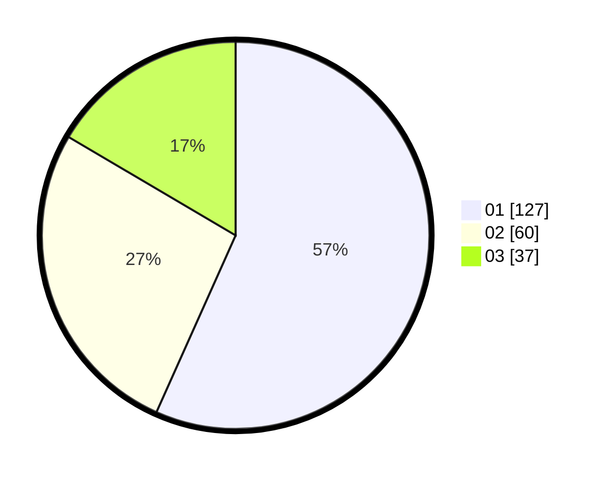

# Hasil

Hasil perolehan suara paslon dapat dilihat pada file paslon-01.txt, paslon-02.txt, dan paslon-03.txt.

Jika tidak ada, artinya data tersebut belum ada pada SIREKAP.

## Perolehan Suara

 * Paslon 01: **127**.
 * Paslon 02: **60**.
 * Paslon 03: **37**.

## Foto C Plano

https://sirekap-obj-formc.kpu.go.id/6c5c/pemilu/ppwp/31/71/08/10/01/3171081001061-20240216-133618--ae685c59-0c7e-4b17-9278-ad5e92c2eb08.jpg

https://sirekap-obj-formc.kpu.go.id/6c5c/pemilu/ppwp/31/71/08/10/01/3171081001061-20240216-133619--5db6ad36-8b0e-4f2f-97d8-6ae43ed54733.jpg

https://sirekap-obj-formc.kpu.go.id/6c5c/pemilu/ppwp/31/71/08/10/01/3171081001061-20240216-133618--4975b547-6c85-43e4-a733-d2db993b4456.jpg

## DATA PEMILIH TETAP

Jumlah pemilih dalam DPT: **281**.
 * L: **133**.
 * P: **148**.

## DATA PENGGUNA HAK PILIH

Jumlah pengguna hak pilih dalam DPT: **223**.
 * L: **103**.
 * P: **120**.

Jumlah pengguna hak pilih dalam DPTb: **4**.
 * L: **0**.
 * P: **4**.

Jumlah pengguna hak pilih dalam DPK: **0**.
 * L: **0**.
 * P: **0**.

Jumlah pengguna hak pilih: **227**.
 * L: **103**.
 * P: **124**.

## JUMLAH SUARA SAH DAN TIDAK SAH

JUMLAH SELURUH SUARA SAH: **224**.

JUMLAH SUARA TIDAK SAH: **3**.

JUMLAH SELURUH SUARA SAH DAN SUARA TIDAK SAH: **227**.
