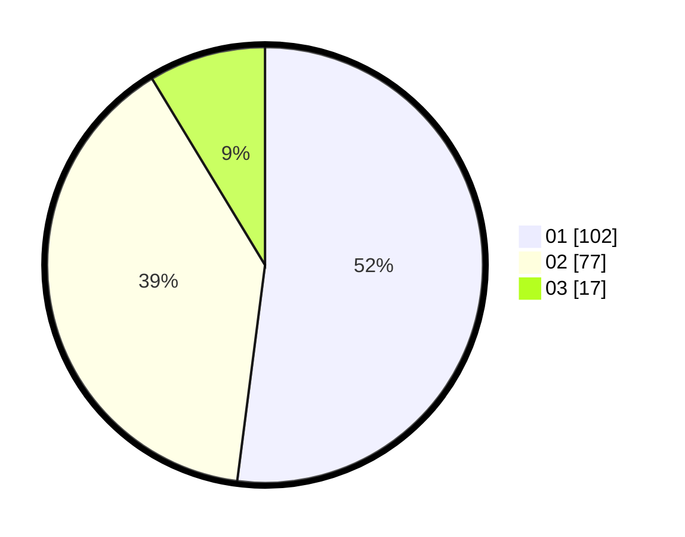

# Hasil

Hasil perolehan suara paslon dapat dilihat pada file paslon-01.txt, paslon-02.txt, dan paslon-03.txt.

Jika tidak ada, artinya data tersebut belum ada pada SIREKAP.

## Perolehan Suara

 * Paslon 01: **102**.
 * Paslon 02: **77**.
 * Paslon 03: **17**.

## Foto C Plano

https://sirekap-obj-formc.kpu.go.id/bb8e/pemilu/ppwp/31/71/08/10/01/3171081001063-20240216-050105--09314192-a2cc-4ab2-b584-cbfe05032528.jpg

https://sirekap-obj-formc.kpu.go.id/bb8e/pemilu/ppwp/31/71/08/10/01/3171081001063-20240216-050108--2a226807-cb06-4182-b9d5-9c353ad87722.jpg

https://sirekap-obj-formc.kpu.go.id/bb8e/pemilu/ppwp/31/71/08/10/01/3171081001063-20240216-050105--12f85b41-5688-4455-852a-91c752f301ef.jpg

## DATA PEMILIH TETAP

Jumlah pemilih dalam DPT: **264**.
 * L: **133**.
 * P: **131**.

## DATA PENGGUNA HAK PILIH

Jumlah pengguna hak pilih dalam DPT: **191**.
 * L: **83**.
 * P: **108**.

Jumlah pengguna hak pilih dalam DPTb: **2**.
 * L: **0**.
 * P: **2**.

Jumlah pengguna hak pilih dalam DPK: **3**.
 * L: **3**.
 * P: **0**.

Jumlah pengguna hak pilih: **196**.
 * L: **86**.
 * P: **110**.

## JUMLAH SUARA SAH DAN TIDAK SAH

JUMLAH SELURUH SUARA SAH: **196**.

JUMLAH SUARA TIDAK SAH: **0**.

JUMLAH SELURUH SUARA SAH DAN SUARA TIDAK SAH: **196**.
