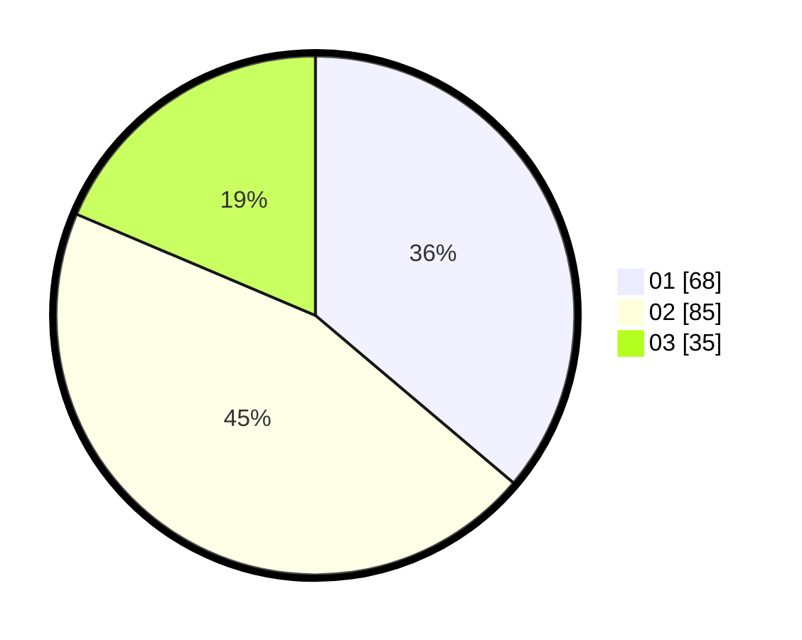

# Hasil

Hasil perolehan suara paslon dapat dilihat pada file paslon-01.txt, paslon-02.txt, dan paslon-03.txt.

Jika tidak ada, artinya data tersebut belum ada pada SIREKAP.

## Perolehan Suara

 * Paslon 01: **68**.
 * Paslon 02: **85**.
 * Paslon 03: **35**.

## Foto C Plano

https://sirekap-obj-formc.kpu.go.id/e5df/pemilu/ppwp/31/71/08/10/01/3171081001065-20240216-152134--536fa7fb-1343-4344-b0a6-51adbb13bcae.jpg

https://sirekap-obj-formc.kpu.go.id/e5df/pemilu/ppwp/31/71/08/10/01/3171081001065-20240216-152135--07f32037-7d39-4302-bdea-d4889633a549.jpg

https://sirekap-obj-formc.kpu.go.id/e5df/pemilu/ppwp/31/71/08/10/01/3171081001065-20240216-152135--0df3226c-a1a9-41cb-9cb9-f31a297d857a.jpg

## DATA PEMILIH TETAP

Jumlah pemilih dalam DPT: **251**.
 * L: **119**.
 * P: **132**.

## DATA PENGGUNA HAK PILIH

Jumlah pengguna hak pilih dalam DPT: **185**.
 * L: **87**.
 * P: **98**.

Jumlah pengguna hak pilih dalam DPTb: **3**.
 * L: **1**.
 * P: **2**.

Jumlah pengguna hak pilih dalam DPK: **2**.
 * L: **2**.
 * P: **0**.

Jumlah pengguna hak pilih: **190**.
 * L: **90**.
 * P: **100**.

## JUMLAH SUARA SAH DAN TIDAK SAH

JUMLAH SELURUH SUARA SAH: **188**.

JUMLAH SUARA TIDAK SAH: **2**.

JUMLAH SELURUH SUARA SAH DAN SUARA TIDAK SAH: **190**.
