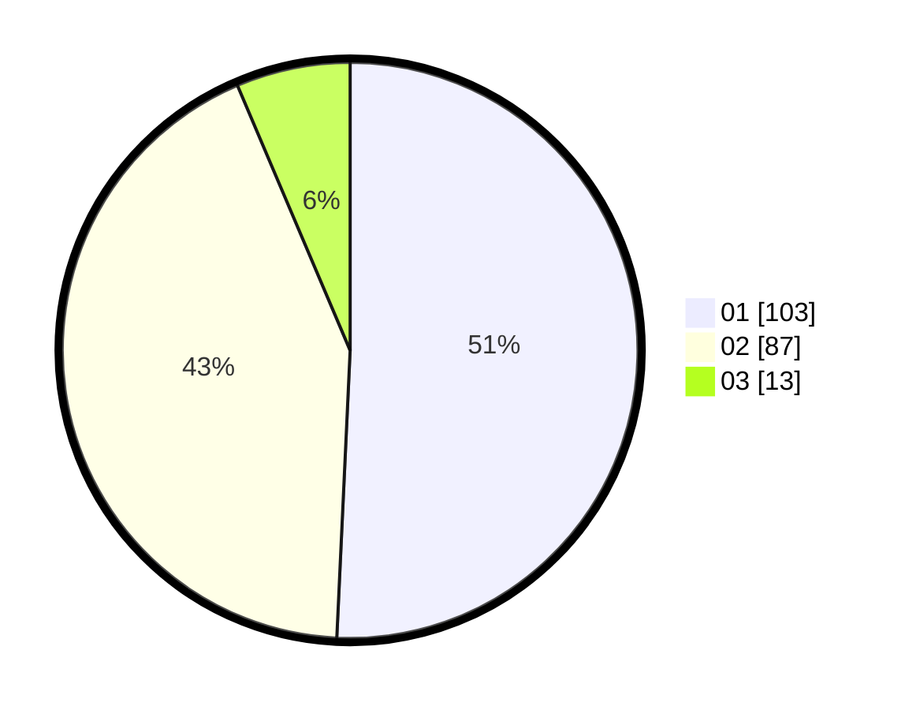

# Hasil

Hasil perolehan suara paslon dapat dilihat pada file paslon-01.txt, paslon-02.txt, dan paslon-03.txt.

Jika tidak ada, artinya data tersebut belum ada pada SIREKAP.

## Perolehan Suara

 * Paslon 01: **103**.
 * Paslon 02: **87**.
 * Paslon 03: **13**.

## Foto C Plano

https://sirekap-obj-formc.kpu.go.id/474c/pemilu/ppwp/31/71/08/10/01/3171081001066-20240215-205315--3ff3fbde-7be2-479b-b18b-d2de6394e64c.jpg

https://sirekap-obj-formc.kpu.go.id/474c/pemilu/ppwp/31/71/08/10/01/3171081001066-20240215-205317--1eff9d11-58e7-44d8-b152-541a138c11f7.jpg

https://sirekap-obj-formc.kpu.go.id/474c/pemilu/ppwp/31/71/08/10/01/3171081001066-20240215-205316--4cab6e87-5872-43a0-8fcd-76b9a879ccb4.jpg

## DATA PEMILIH TETAP

Jumlah pemilih dalam DPT: **272**.
 * L: **131**.
 * P: **141**.

## DATA PENGGUNA HAK PILIH

Jumlah pengguna hak pilih dalam DPT: **202**.
 * L: **89**.
 * P: **113**.

Jumlah pengguna hak pilih dalam DPTb: **1**.
 * L: **0**.
 * P: **1**.

Jumlah pengguna hak pilih dalam DPK: **0**.
 * L: **0**.
 * P: **0**.

Jumlah pengguna hak pilih: **203**.
 * L: **89**.
 * P: **114**.

## JUMLAH SUARA SAH DAN TIDAK SAH

JUMLAH SELURUH SUARA SAH: **203**.

JUMLAH SUARA TIDAK SAH: **2**.

JUMLAH SELURUH SUARA SAH DAN SUARA TIDAK SAH: **205**.
