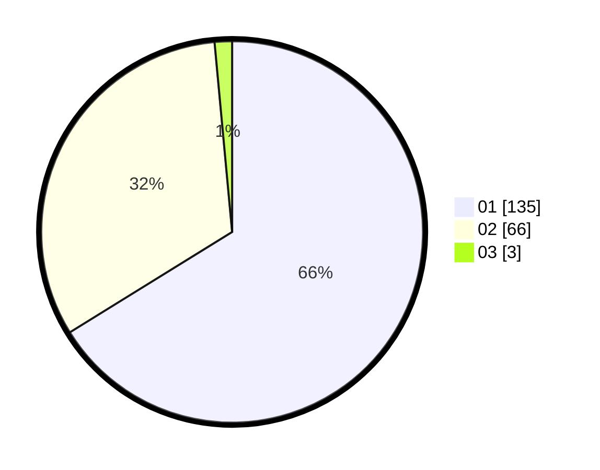

# Hasil

Hasil perolehan suara paslon dapat dilihat pada file paslon-01.txt, paslon-02.txt, dan paslon-03.txt.

Jika tidak ada, artinya data tersebut belum ada pada SIREKAP.

## Perolehan Suara

 * Paslon 01: **135**.
 * Paslon 02: **66**.
 * Paslon 03: **3**.

## Foto C Plano

https://sirekap-obj-formc.kpu.go.id/ca7f/pemilu/ppwp/31/71/08/10/01/3171081001067-20240216-151543--9f0ad4d7-8c11-4998-be7d-abce56761cee.jpg

https://sirekap-obj-formc.kpu.go.id/ca7f/pemilu/ppwp/31/71/08/10/01/3171081001067-20240216-151544--6060e544-35ce-4165-947f-59a91ba1cc62.jpg

https://sirekap-obj-formc.kpu.go.id/ca7f/pemilu/ppwp/31/71/08/10/01/3171081001067-20240216-151543--4c4887a6-6e76-4a9e-9518-616f36e19856.jpg

## DATA PEMILIH TETAP

Jumlah pemilih dalam DPT: **281**.
 * L: **142**.
 * P: **139**.

## DATA PENGGUNA HAK PILIH

Jumlah pengguna hak pilih dalam DPT: **208**.
 * L: **100**.
 * P: **108**.

Jumlah pengguna hak pilih dalam DPTb: **0**.
 * L: **0**.
 * P: **0**.

Jumlah pengguna hak pilih dalam DPK: **4**.
 * L: **2**.
 * P: **2**.

Jumlah pengguna hak pilih: **212**.
 * L: **102**.
 * P: **110**.

## JUMLAH SUARA SAH DAN TIDAK SAH

JUMLAH SELURUH SUARA SAH: **204**.

JUMLAH SUARA TIDAK SAH: **8**.

JUMLAH SELURUH SUARA SAH DAN SUARA TIDAK SAH: **212**.
