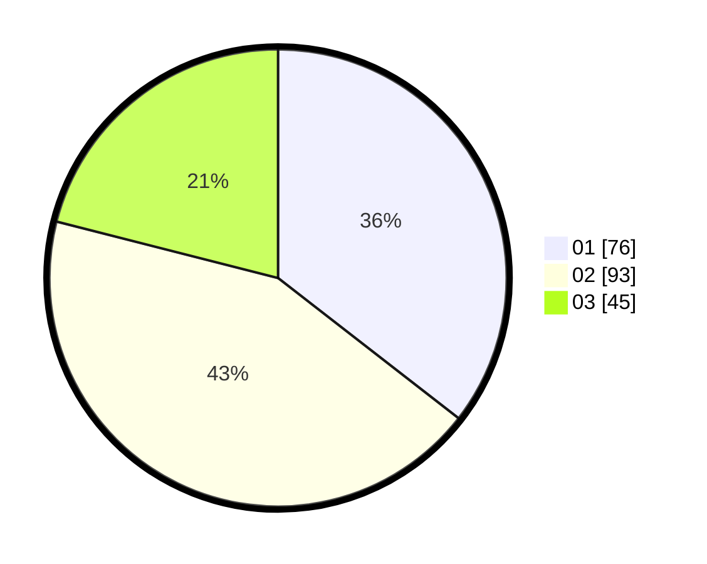

# Hasil

Hasil perolehan suara paslon dapat dilihat pada file paslon-01.txt, paslon-02.txt, dan paslon-03.txt.

Jika tidak ada, artinya data tersebut belum ada pada SIREKAP.

## Perolehan Suara

 * Paslon 01: **76**.
 * Paslon 02: **93**.
 * Paslon 03: **45**.

## Foto C Plano

https://sirekap-obj-formc.kpu.go.id/7d91/pemilu/ppwp/31/71/08/10/01/3171081001072-20240216-155103--702f87fa-e8c2-4d80-94b9-19ea314f059c.jpg

https://sirekap-obj-formc.kpu.go.id/7d91/pemilu/ppwp/31/71/08/10/01/3171081001072-20240216-155104--01fe0f64-54fb-4417-9246-2a2749092cb1.jpg

https://sirekap-obj-formc.kpu.go.id/7d91/pemilu/ppwp/31/71/08/10/01/3171081001072-20240216-155104--cd328333-1162-4581-aec3-b7cdf46bf061.jpg

## DATA PEMILIH TETAP

Jumlah pemilih dalam DPT: **288**.
 * L: **135**.
 * P: **153**.

## DATA PENGGUNA HAK PILIH

Jumlah pengguna hak pilih dalam DPT: **288**.
 * L: **135**.
 * P: **153**.

Jumlah pengguna hak pilih dalam DPTb: **4**.
 * L: **3**.
 * P: **1**.

Jumlah pengguna hak pilih dalam DPK: **3**.
 * L: **2**.
 * P: **1**.

Jumlah pengguna hak pilih: **295**.
 * L: **140**.
 * P: **155**.

## JUMLAH SUARA SAH DAN TIDAK SAH

JUMLAH SELURUH SUARA SAH: **214**.

JUMLAH SUARA TIDAK SAH: **3**.

JUMLAH SELURUH SUARA SAH DAN SUARA TIDAK SAH: **217**.
