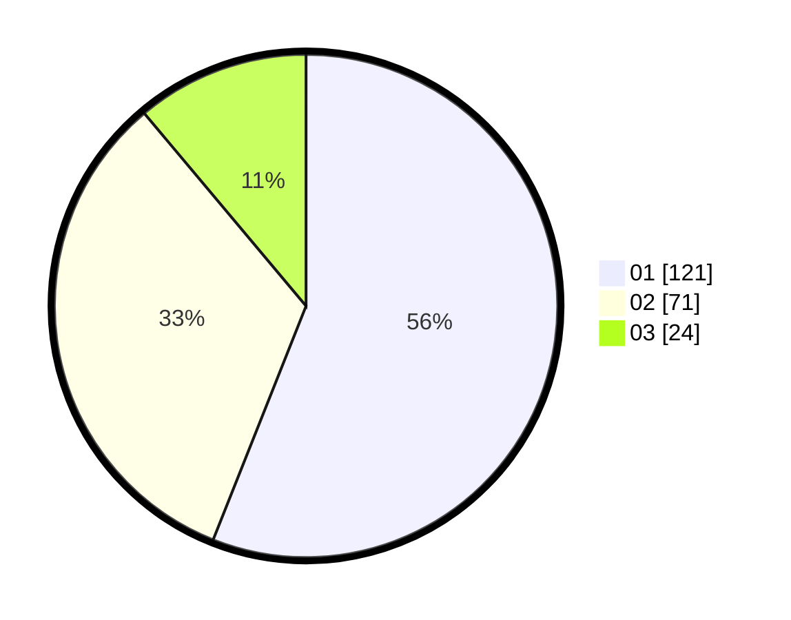

# Hasil

Hasil perolehan suara paslon dapat dilihat pada file paslon-01.txt, paslon-02.txt, dan paslon-03.txt.

Jika tidak ada, artinya data tersebut belum ada pada SIREKAP.

## Perolehan Suara

 * Paslon 01: **121**.
 * Paslon 02: **71**.
 * Paslon 03: **24**.

## Foto C Plano

https://sirekap-obj-formc.kpu.go.id/9261/pemilu/ppwp/31/71/08/10/01/3171081001074-20240216-150458--7de8460b-3105-4e24-9feb-10446d09fa25.jpg

https://sirekap-obj-formc.kpu.go.id/9261/pemilu/ppwp/31/71/08/10/01/3171081001074-20240216-150500--5d4d6fbc-6b75-412d-bdf8-84ad85ac898f.jpg

https://sirekap-obj-formc.kpu.go.id/9261/pemilu/ppwp/31/71/08/10/01/3171081001074-20240216-150459--a4add3a0-6c91-4efc-bd4e-9484b486a860.jpg

## DATA PEMILIH TETAP

Jumlah pemilih dalam DPT: **223**.
 * L: **102**.
 * P: **121**.

## DATA PENGGUNA HAK PILIH

Jumlah pengguna hak pilih dalam DPT: **210**.
 * L: **99**.
 * P: **111**.

Jumlah pengguna hak pilih dalam DPTb: **13**.
 * L: **3**.
 * P: **10**.

Jumlah pengguna hak pilih dalam DPK: **0**.
 * L: **0**.
 * P: **0**.

Jumlah pengguna hak pilih: **223**.
 * L: **102**.
 * P: **121**.

## JUMLAH SUARA SAH DAN TIDAK SAH

JUMLAH SELURUH SUARA SAH: **216**.

JUMLAH SUARA TIDAK SAH: **7**.

JUMLAH SELURUH SUARA SAH DAN SUARA TIDAK SAH: **223**.
