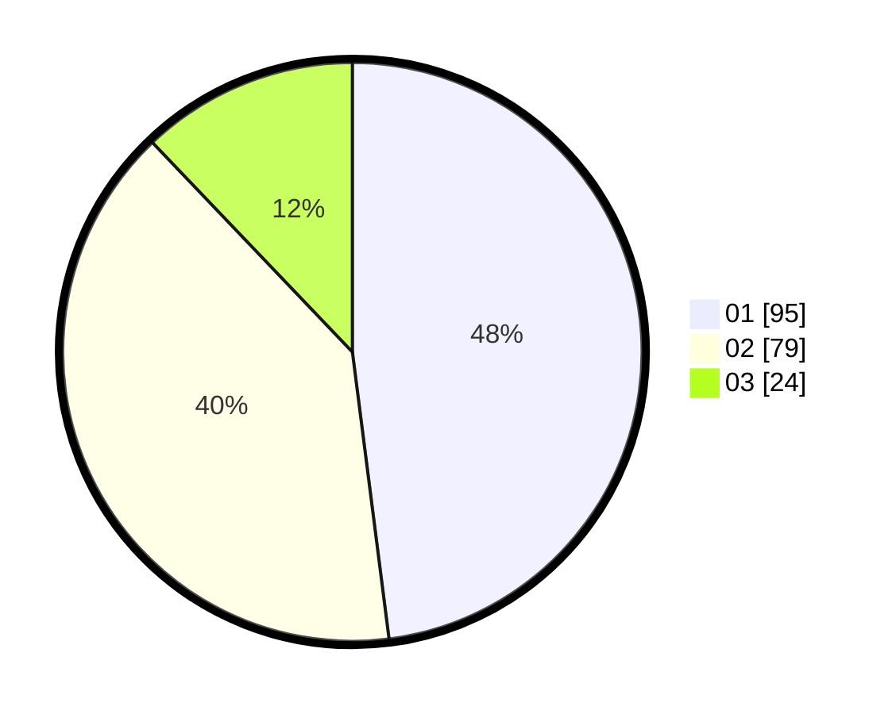

# Hasil

Hasil perolehan suara paslon dapat dilihat pada file paslon-01.txt, paslon-02.txt, dan paslon-03.txt.

Jika tidak ada, artinya data tersebut belum ada pada SIREKAP.

## Perolehan Suara

 * Paslon 01: **95**.
 * Paslon 02: **79**.
 * Paslon 03: **24**.

## Foto C Plano

https://sirekap-obj-formc.kpu.go.id/2e80/pemilu/ppwp/31/71/08/10/01/3171081001077-20240216-162607--69d3ea4b-642c-4f43-8fbc-f7929befa48a.jpg

https://sirekap-obj-formc.kpu.go.id/2e80/pemilu/ppwp/31/71/08/10/01/3171081001077-20240216-162608--13dc75b1-2a04-4b7b-a62d-a942c1d907f0.jpg

https://sirekap-obj-formc.kpu.go.id/2e80/pemilu/ppwp/31/71/08/10/01/3171081001077-20240216-162607--0fc3bb0d-c65c-4b53-92fa-c6d9521ed97c.jpg

## DATA PEMILIH TETAP

Jumlah pemilih dalam DPT: **252**.
 * L: **120**.
 * P: **132**.

## DATA PENGGUNA HAK PILIH

Jumlah pengguna hak pilih dalam DPT: **204**.
 * L: **91**.
 * P: **113**.

Jumlah pengguna hak pilih dalam DPTb: **0**.
 * L: **0**.
 * P: **0**.

Jumlah pengguna hak pilih dalam DPK: **0**.
 * L: **0**.
 * P: **0**.

Jumlah pengguna hak pilih: **204**.
 * L: **91**.
 * P: **113**.

## JUMLAH SUARA SAH DAN TIDAK SAH

JUMLAH SELURUH SUARA SAH: **198**.

JUMLAH SUARA TIDAK SAH: **6**.

JUMLAH SELURUH SUARA SAH DAN SUARA TIDAK SAH: **204**.
