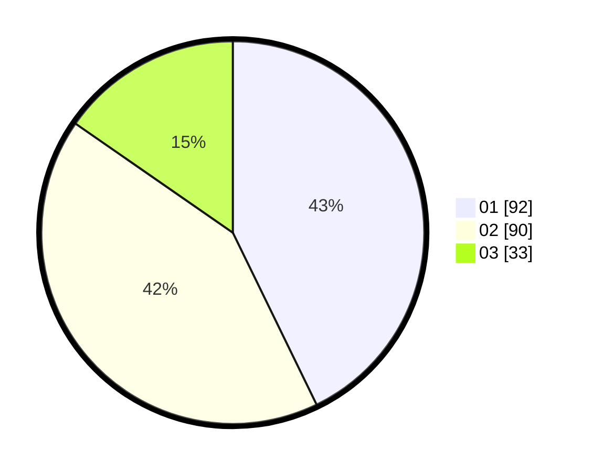

# Hasil

Hasil perolehan suara paslon dapat dilihat pada file paslon-01.txt, paslon-02.txt, dan paslon-03.txt.

Jika tidak ada, artinya data tersebut belum ada pada SIREKAP.

## Perolehan Suara

 * Paslon 01: **92**.
 * Paslon 02: **90**.
 * Paslon 03: **33**.

## Foto C Plano

https://sirekap-obj-formc.kpu.go.id/11cf/pemilu/ppwp/31/71/08/10/01/3171081001079-20240216-151639--8bbc74ea-8013-46c2-83d9-b103a3142cde.jpg

https://sirekap-obj-formc.kpu.go.id/11cf/pemilu/ppwp/31/71/08/10/01/3171081001079-20240216-151640--3ee3e127-9560-4a51-8dd4-a593aa3c3802.jpg

https://sirekap-obj-formc.kpu.go.id/11cf/pemilu/ppwp/31/71/08/10/01/3171081001079-20240216-151639--a0eaeb48-ebea-4a5a-9e00-7b3145c4cc03.jpg

## DATA PEMILIH TETAP

Jumlah pemilih dalam DPT: **262**.
 * L: **136**.
 * P: **126**.

## DATA PENGGUNA HAK PILIH

Jumlah pengguna hak pilih dalam DPT: **213**.
 * L: **103**.
 * P: **110**.

Jumlah pengguna hak pilih dalam DPTb: **2**.
 * L: **1**.
 * P: **1**.

Jumlah pengguna hak pilih dalam DPK: **3**.
 * L: **2**.
 * P: **1**.

Jumlah pengguna hak pilih: **218**.
 * L: **105**.
 * P: **112**.

## JUMLAH SUARA SAH DAN TIDAK SAH

JUMLAH SELURUH SUARA SAH: **215**.

JUMLAH SUARA TIDAK SAH: **3**.

JUMLAH SELURUH SUARA SAH DAN SUARA TIDAK SAH: **218**.
