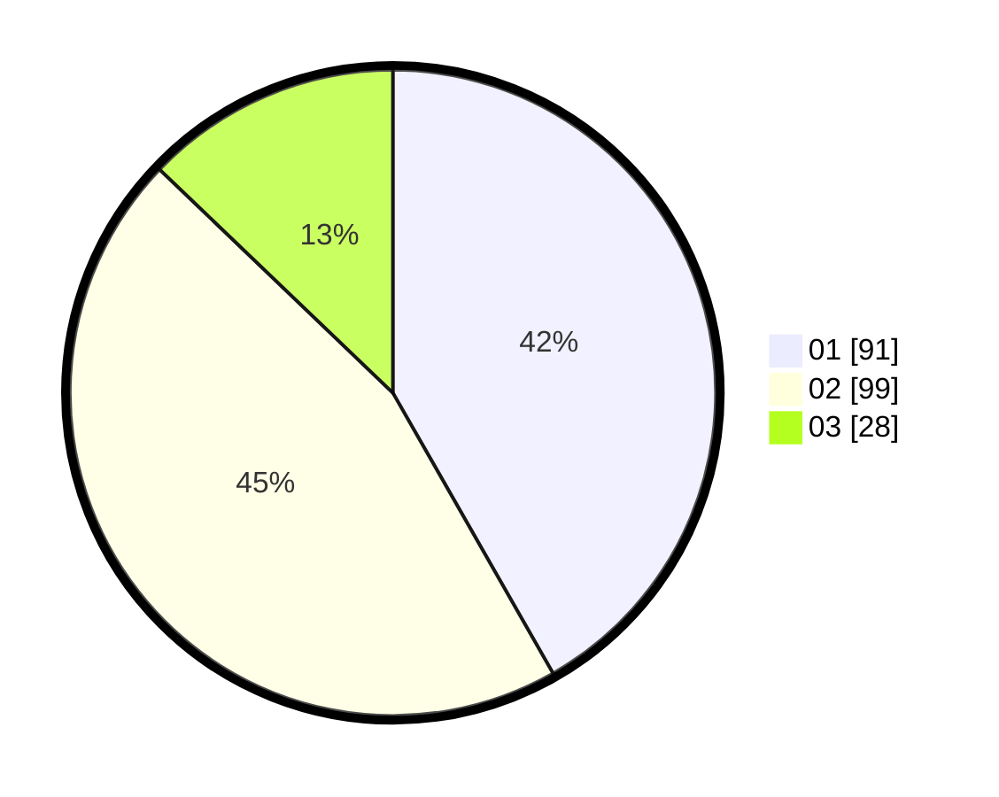

# Hasil

Hasil perolehan suara paslon dapat dilihat pada file paslon-01.txt, paslon-02.txt, dan paslon-03.txt.

Jika tidak ada, artinya data tersebut belum ada pada SIREKAP.

## Perolehan Suara

 * Paslon 01: **91**.
 * Paslon 02: **99**.
 * Paslon 03: **28**.

## Foto C Plano

https://sirekap-obj-formc.kpu.go.id/e084/pemilu/ppwp/31/71/08/10/01/3171081001080-20240216-160943--841460f4-bcdf-4a8d-ace1-a2ce3bb47c00.jpg

https://sirekap-obj-formc.kpu.go.id/e084/pemilu/ppwp/31/71/08/10/01/3171081001080-20240216-160945--56dbab99-86b1-4c93-9a39-a66539e1988d.jpg

https://sirekap-obj-formc.kpu.go.id/e084/pemilu/ppwp/31/71/08/10/01/3171081001080-20240216-160944--c728c179-8651-4ab3-98c3-049ddf7100bb.jpg

## DATA PEMILIH TETAP

Jumlah pemilih dalam DPT: **260**.
 * L: **129**.
 * P: **131**.

## DATA PENGGUNA HAK PILIH

Jumlah pengguna hak pilih dalam DPT: **220**.
 * L: **104**.
 * P: **116**.

Jumlah pengguna hak pilih dalam DPTb: **0**.
 * L: **0**.
 * P: **0**.

Jumlah pengguna hak pilih dalam DPK: **0**.
 * L: **0**.
 * P: **0**.

Jumlah pengguna hak pilih: **220**.
 * L: **104**.
 * P: **116**.

## JUMLAH SUARA SAH DAN TIDAK SAH

JUMLAH SELURUH SUARA SAH: **218**.

JUMLAH SUARA TIDAK SAH: **2**.

JUMLAH SELURUH SUARA SAH DAN SUARA TIDAK SAH: **220**.
