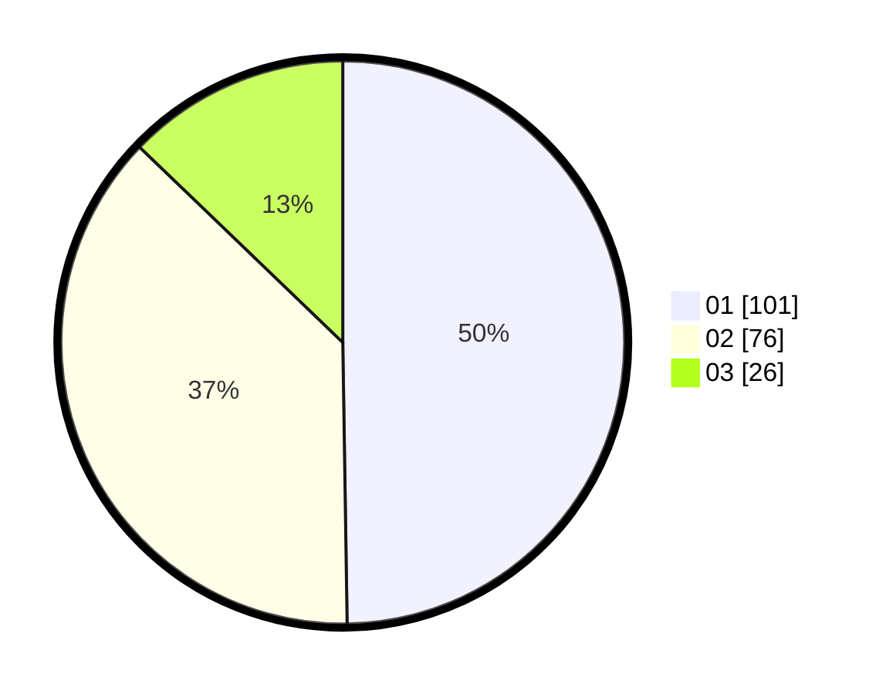

# Hasil

Hasil perolehan suara paslon dapat dilihat pada file paslon-01.txt, paslon-02.txt, dan paslon-03.txt.

Jika tidak ada, artinya data tersebut belum ada pada SIREKAP.

## Perolehan Suara

 * Paslon 01: **101**.
 * Paslon 02: **76**.
 * Paslon 03: **26**.

## Foto C Plano

https://sirekap-obj-formc.kpu.go.id/d058/pemilu/ppwp/31/71/08/10/01/3171081001081-20240216-150122--424c14f4-3396-44be-82b5-d43b580e095d.jpg

https://sirekap-obj-formc.kpu.go.id/d058/pemilu/ppwp/31/71/08/10/01/3171081001081-20240216-150124--03b47bc1-ee81-45b1-bf91-3fce0527a209.jpg

https://sirekap-obj-formc.kpu.go.id/d058/pemilu/ppwp/31/71/08/10/01/3171081001081-20240216-150123--712822dc-4997-4470-8498-7dc084f2069a.jpg

## DATA PEMILIH TETAP

Jumlah pemilih dalam DPT: **264**.
 * L: **127**.
 * P: **137**.

## DATA PENGGUNA HAK PILIH

Jumlah pengguna hak pilih dalam DPT: **264**.
 * L: **127**.
 * P: **137**.

Jumlah pengguna hak pilih dalam DPTb: **0**.
 * L: **0**.
 * P: **0**.

Jumlah pengguna hak pilih dalam DPK: **2**.
 * L: **1**.
 * P: **1**.

Jumlah pengguna hak pilih: **266**.
 * L: **128**.
 * P: **138**.

## JUMLAH SUARA SAH DAN TIDAK SAH

JUMLAH SELURUH SUARA SAH: **203**.

JUMLAH SUARA TIDAK SAH: **6**.

JUMLAH SELURUH SUARA SAH DAN SUARA TIDAK SAH: **209**.
