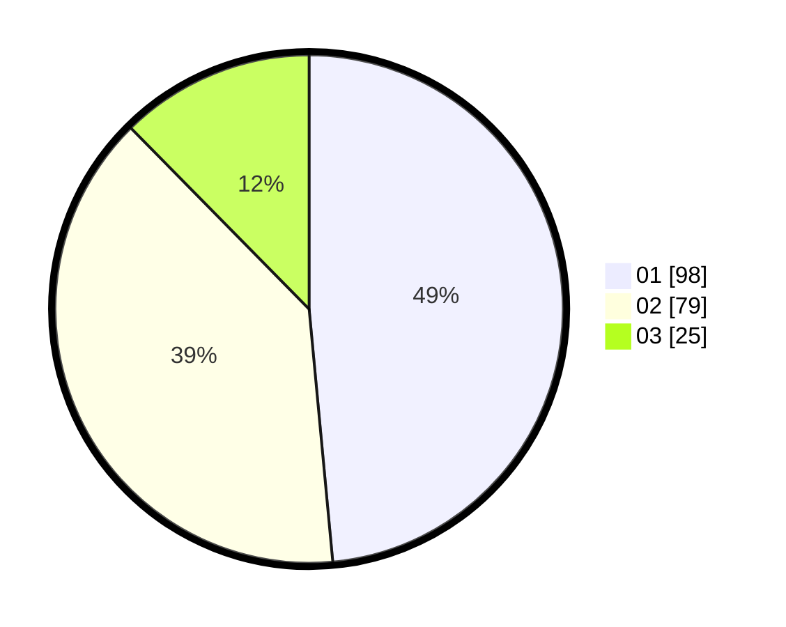

# Hasil

Hasil perolehan suara paslon dapat dilihat pada file paslon-01.txt, paslon-02.txt, dan paslon-03.txt.

Jika tidak ada, artinya data tersebut belum ada pada SIREKAP.

## Perolehan Suara

 * Paslon 01: **98**.
 * Paslon 02: **79**.
 * Paslon 03: **25**.

## Foto C Plano

https://sirekap-obj-formc.kpu.go.id/ae11/pemilu/ppwp/31/71/08/10/01/3171081001082-20240214-201748--ff1f68ab-a692-4773-8301-d547a705e3d3.jpg

https://sirekap-obj-formc.kpu.go.id/ae11/pemilu/ppwp/31/71/08/10/01/3171081001082-20240216-151526--ff02c067-26ae-4b08-9035-16aeadc9e75b.jpg

https://sirekap-obj-formc.kpu.go.id/ae11/pemilu/ppwp/31/71/08/10/01/3171081001082-20240214-201820--c96899d6-ab01-4785-94b6-1392b1c78cd4.jpg

## DATA PEMILIH TETAP

Jumlah pemilih dalam DPT: **202**.
 * L: **95**.
 * P: **107**.

## DATA PENGGUNA HAK PILIH

Jumlah pengguna hak pilih dalam DPT: **196**.
 * L: **94**.
 * P: **102**.

Jumlah pengguna hak pilih dalam DPTb: **3**.
 * L: **0**.
 * P: **3**.

Jumlah pengguna hak pilih dalam DPK: **3**.
 * L: **1**.
 * P: **2**.

Jumlah pengguna hak pilih: **202**.
 * L: **95**.
 * P: **107**.

## JUMLAH SUARA SAH DAN TIDAK SAH

JUMLAH SELURUH SUARA SAH: **202**.

JUMLAH SUARA TIDAK SAH: **8**.

JUMLAH SELURUH SUARA SAH DAN SUARA TIDAK SAH: **210**.
