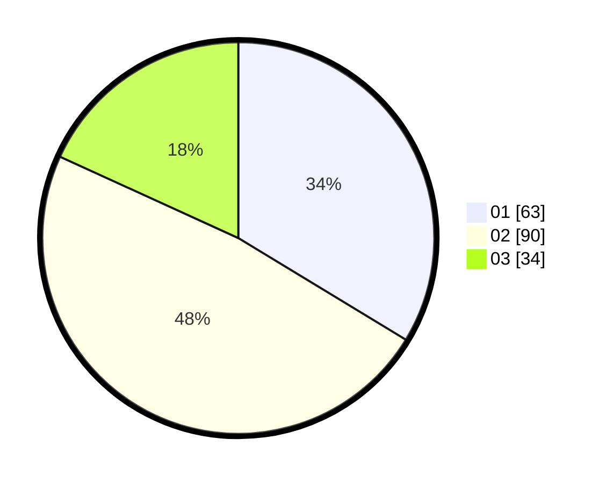

# Hasil

Hasil perolehan suara paslon dapat dilihat pada file paslon-01.txt, paslon-02.txt, dan paslon-03.txt.

Jika tidak ada, artinya data tersebut belum ada pada SIREKAP.

## Perolehan Suara

 * Paslon 01: **63**.
 * Paslon 02: **90**.
 * Paslon 03: **34**.

## Foto C Plano

https://sirekap-obj-formc.kpu.go.id/4602/pemilu/ppwp/31/71/08/10/01/3171081001083-20240216-155524--3e5625af-e019-4eef-9880-a75918557cf6.jpg

https://sirekap-obj-formc.kpu.go.id/4602/pemilu/ppwp/31/71/08/10/01/3171081001083-20240216-155526--3d4e39ff-8b70-468a-9b78-eb0216a888bc.jpg

https://sirekap-obj-formc.kpu.go.id/4602/pemilu/ppwp/31/71/08/10/01/3171081001083-20240216-155525--91e08152-163d-4f7d-86c6-79c16459eaa8.jpg

## DATA PEMILIH TETAP

Jumlah pemilih dalam DPT: **255**.
 * L: **118**.
 * P: **137**.

## DATA PENGGUNA HAK PILIH

Jumlah pengguna hak pilih dalam DPT: **187**.
 * L: **76**.
 * P: **111**.

Jumlah pengguna hak pilih dalam DPTb: **4**.
 * L: **2**.
 * P: **2**.

Jumlah pengguna hak pilih dalam DPK: **1**.
 * L: **1**.
 * P: **0**.

Jumlah pengguna hak pilih: **192**.
 * L: **79**.
 * P: **113**.

## JUMLAH SUARA SAH DAN TIDAK SAH

JUMLAH SELURUH SUARA SAH: **187**.

JUMLAH SUARA TIDAK SAH: **5**.

JUMLAH SELURUH SUARA SAH DAN SUARA TIDAK SAH: **192**.
