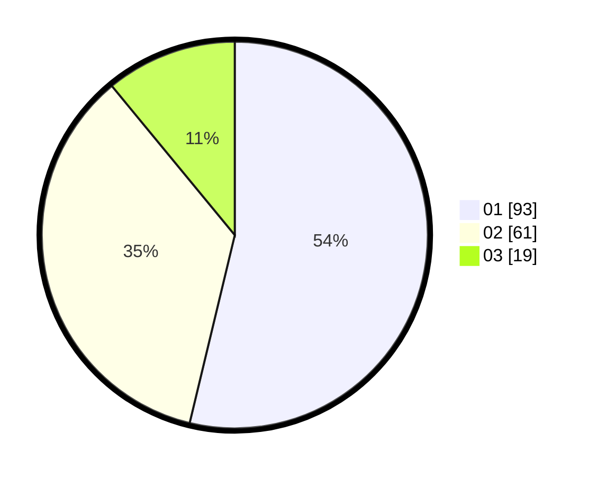

# Hasil

Hasil perolehan suara paslon dapat dilihat pada file paslon-01.txt, paslon-02.txt, dan paslon-03.txt.

Jika tidak ada, artinya data tersebut belum ada pada SIREKAP.

## Perolehan Suara

 * Paslon 01: **93**.
 * Paslon 02: **61**.
 * Paslon 03: **19**.

## Foto C Plano

https://sirekap-obj-formc.kpu.go.id/dbdd/pemilu/ppwp/31/71/08/10/01/3171081001084-20240215-211809--ace89bcb-1eb2-4494-a6e8-a83e63ef00e9.jpg

https://sirekap-obj-formc.kpu.go.id/dbdd/pemilu/ppwp/31/71/08/10/01/3171081001084-20240215-211813--02636838-a2fb-48ba-b6d6-857ad773aef1.jpg

https://sirekap-obj-formc.kpu.go.id/dbdd/pemilu/ppwp/31/71/08/10/01/3171081001084-20240215-211811--2e9a6fef-d0e2-4d2b-b57b-044200a7036d.jpg

## DATA PEMILIH TETAP

Jumlah pemilih dalam DPT: **230**.
 * L: **116**.
 * P: **114**.

## DATA PENGGUNA HAK PILIH

Jumlah pengguna hak pilih dalam DPT: **170**.
 * L: **76**.
 * P: **94**.

Jumlah pengguna hak pilih dalam DPTb: **4**.
 * L: **2**.
 * P: **2**.

Jumlah pengguna hak pilih dalam DPK: **2**.
 * L: **1**.
 * P: **1**.

Jumlah pengguna hak pilih: **176**.
 * L: **79**.
 * P: **97**.

## JUMLAH SUARA SAH DAN TIDAK SAH

JUMLAH SELURUH SUARA SAH: **173**.

JUMLAH SUARA TIDAK SAH: **3**.

JUMLAH SELURUH SUARA SAH DAN SUARA TIDAK SAH: **176**.
