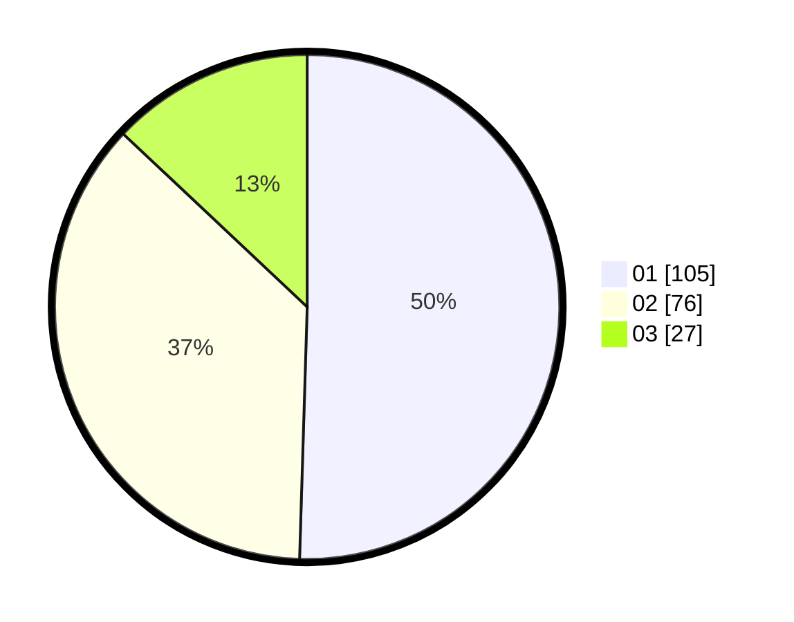

# Hasil

Hasil perolehan suara paslon dapat dilihat pada file paslon-01.txt, paslon-02.txt, dan paslon-03.txt.

Jika tidak ada, artinya data tersebut belum ada pada SIREKAP.

## Perolehan Suara

 * Paslon 01: **105**.
 * Paslon 02: **76**.
 * Paslon 03: **27**.

## Foto C Plano

https://sirekap-obj-formc.kpu.go.id/d31d/pemilu/ppwp/31/71/08/10/01/3171081001088-20240216-153611--c3355743-e659-41b8-9bc6-cc619a76c4b4.jpg

https://sirekap-obj-formc.kpu.go.id/d31d/pemilu/ppwp/31/71/08/10/01/3171081001088-20240216-153613--9e6e945a-3056-414f-ad4b-9d75fe8abe4b.jpg

https://sirekap-obj-formc.kpu.go.id/d31d/pemilu/ppwp/31/71/08/10/01/3171081001088-20240216-153612--36119bb1-8822-480a-a5e5-e00ed7e8eb65.jpg

## DATA PEMILIH TETAP

Jumlah pemilih dalam DPT: **246**.
 * L: **121**.
 * P: **125**.

## DATA PENGGUNA HAK PILIH

Jumlah pengguna hak pilih dalam DPT: **208**.
 * L: **101**.
 * P: **107**.

Jumlah pengguna hak pilih dalam DPTb: **0**.
 * L: **0**.
 * P: **0**.

Jumlah pengguna hak pilih dalam DPK: **1**.
 * L: **0**.
 * P: **1**.

Jumlah pengguna hak pilih: **209**.
 * L: **101**.
 * P: **108**.

## JUMLAH SUARA SAH DAN TIDAK SAH

JUMLAH SELURUH SUARA SAH: **208**.

JUMLAH SUARA TIDAK SAH: **1**.

JUMLAH SELURUH SUARA SAH DAN SUARA TIDAK SAH: **209**.
