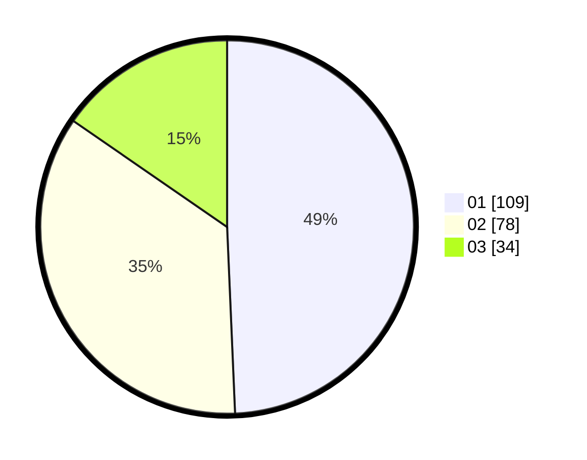

# Hasil

Hasil perolehan suara paslon dapat dilihat pada file paslon-01.txt, paslon-02.txt, dan paslon-03.txt.

Jika tidak ada, artinya data tersebut belum ada pada SIREKAP.

## Perolehan Suara

 * Paslon 01: **109**.
 * Paslon 02: **78**.
 * Paslon 03: **34**.

## Foto C Plano

https://sirekap-obj-formc.kpu.go.id/9421/pemilu/ppwp/31/71/08/10/01/3171081001090-20240216-150236--e9c46fbb-eca1-46f2-9712-8c8f9e1b1bb5.jpg

https://sirekap-obj-formc.kpu.go.id/9421/pemilu/ppwp/31/71/08/10/01/3171081001090-20240216-150237--62a4c935-3aca-4ce9-9ec3-abdc9f1fd400.jpg

https://sirekap-obj-formc.kpu.go.id/9421/pemilu/ppwp/31/71/08/10/01/3171081001090-20240216-150237--f95afc63-1721-498e-be22-a4720d5059be.jpg

## DATA PEMILIH TETAP

Jumlah pemilih dalam DPT: **278**.
 * L: **123**.
 * P: **155**.

## DATA PENGGUNA HAK PILIH

Jumlah pengguna hak pilih dalam DPT: **217**.
 * L: **100**.
 * P: **117**.

Jumlah pengguna hak pilih dalam DPTb: **5**.
 * L: **1**.
 * P: **4**.

Jumlah pengguna hak pilih dalam DPK: **4**.
 * L: **4**.
 * P: **0**.

Jumlah pengguna hak pilih: **226**.
 * L: **105**.
 * P: **121**.

## JUMLAH SUARA SAH DAN TIDAK SAH

JUMLAH SELURUH SUARA SAH: **221**.

JUMLAH SUARA TIDAK SAH: **5**.

JUMLAH SELURUH SUARA SAH DAN SUARA TIDAK SAH: **226**.
