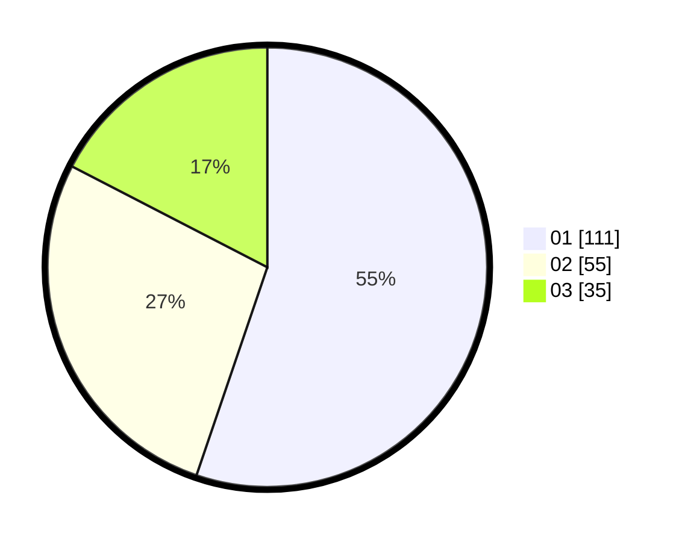

# Hasil

Hasil perolehan suara paslon dapat dilihat pada file paslon-01.txt, paslon-02.txt, dan paslon-03.txt.

Jika tidak ada, artinya data tersebut belum ada pada SIREKAP.

## Perolehan Suara

 * Paslon 01: **111**.
 * Paslon 02: **55**.
 * Paslon 03: **35**.

## Foto C Plano

https://sirekap-obj-formc.kpu.go.id/405d/pemilu/ppwp/31/71/08/10/01/3171081001092-20240214-193101--2660a4aa-e186-4d83-841e-ce5d04ea4728.jpg

https://sirekap-obj-formc.kpu.go.id/405d/pemilu/ppwp/31/71/08/10/01/3171081001092-20240214-193302--03117487-66ed-4652-98fc-1e9fe67c68f0.jpg

https://sirekap-obj-formc.kpu.go.id/405d/pemilu/ppwp/31/71/08/10/01/3171081001092-20240214-193404--e3c8996e-7237-4d19-8316-2430e88d8103.jpg

## DATA PEMILIH TETAP

Jumlah pemilih dalam DPT: **259**.
 * L: **125**.
 * P: **134**.

## DATA PENGGUNA HAK PILIH

Jumlah pengguna hak pilih dalam DPT: **197**.
 * L: **96**.
 * P: **101**.

Jumlah pengguna hak pilih dalam DPTb: **8**.
 * L: **4**.
 * P: **4**.

Jumlah pengguna hak pilih dalam DPK: **1**.
 * L: **1**.
 * P: **0**.

Jumlah pengguna hak pilih: **206**.
 * L: **101**.
 * P: **105**.

## JUMLAH SUARA SAH DAN TIDAK SAH

JUMLAH SELURUH SUARA SAH: **201**.

JUMLAH SUARA TIDAK SAH: **5**.

JUMLAH SELURUH SUARA SAH DAN SUARA TIDAK SAH: **206**.
