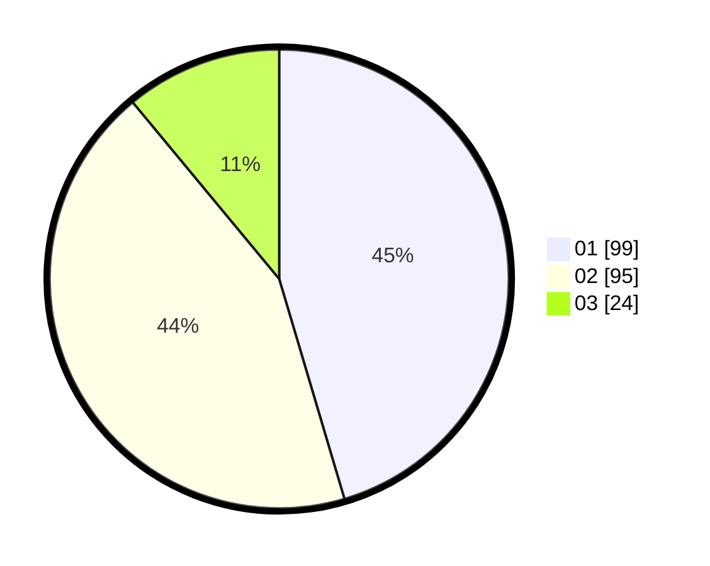

# Hasil

Hasil perolehan suara paslon dapat dilihat pada file paslon-01.txt, paslon-02.txt, dan paslon-03.txt.

Jika tidak ada, artinya data tersebut belum ada pada SIREKAP.

## Perolehan Suara

 * Paslon 01: **99**.
 * Paslon 02: **95**.
 * Paslon 03: **24**.

## Foto C Plano

https://sirekap-obj-formc.kpu.go.id/d3cd/pemilu/ppwp/31/71/08/10/01/3171081001093-20240216-151145--0112ef72-f966-4456-91a8-8ab43d359425.jpg

https://sirekap-obj-formc.kpu.go.id/d3cd/pemilu/ppwp/31/71/08/10/01/3171081001093-20240216-151146--f5a2bf60-1796-410b-a433-13027df591b5.jpg

https://sirekap-obj-formc.kpu.go.id/d3cd/pemilu/ppwp/31/71/08/10/01/3171081001093-20240216-151146--7a12372f-e33e-40b6-b56b-50851a99e332.jpg

## DATA PEMILIH TETAP

Jumlah pemilih dalam DPT: **280**.
 * L: **138**.
 * P: **142**.

## DATA PENGGUNA HAK PILIH

Jumlah pengguna hak pilih dalam DPT: **217**.
 * L: **100**.
 * P: **117**.

Jumlah pengguna hak pilih dalam DPTb: **2**.
 * L: **1**.
 * P: **1**.

Jumlah pengguna hak pilih dalam DPK: **2**.
 * L: **0**.
 * P: **2**.

Jumlah pengguna hak pilih: **221**.
 * L: **101**.
 * P: **120**.

## JUMLAH SUARA SAH DAN TIDAK SAH

JUMLAH SELURUH SUARA SAH: **218**.

JUMLAH SUARA TIDAK SAH: **3**.

JUMLAH SELURUH SUARA SAH DAN SUARA TIDAK SAH: **221**.
