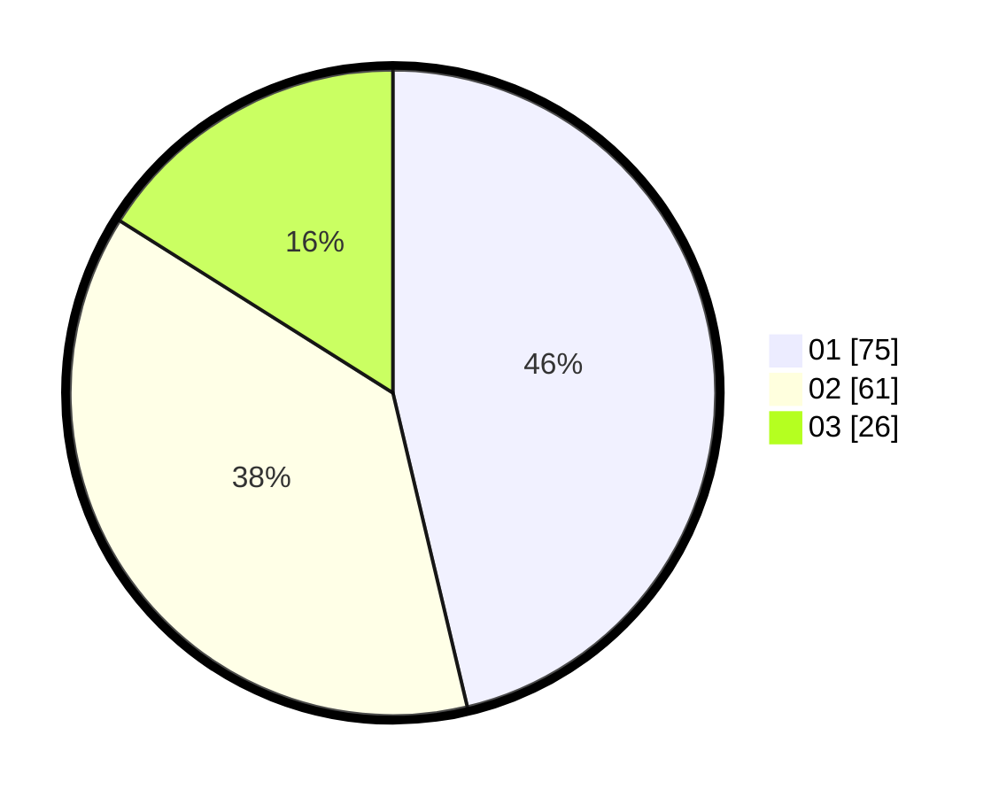

# Hasil

Hasil perolehan suara paslon dapat dilihat pada file paslon-01.txt, paslon-02.txt, dan paslon-03.txt.

Jika tidak ada, artinya data tersebut belum ada pada SIREKAP.

## Perolehan Suara

 * Paslon 01: **75**.
 * Paslon 02: **61**.
 * Paslon 03: **26**.

## Foto C Plano

https://sirekap-obj-formc.kpu.go.id/e144/pemilu/ppwp/31/71/08/10/01/3171081001100-20240216-150518--9dc22f5f-b87f-442d-9aab-b60e86c77ba1.jpg

https://sirekap-obj-formc.kpu.go.id/e144/pemilu/ppwp/31/71/08/10/01/3171081001100-20240216-150519--21192781-55c0-447a-8967-ac7ed6784ca1.jpg

https://sirekap-obj-formc.kpu.go.id/e144/pemilu/ppwp/31/71/08/10/01/3171081001100-20240216-150518--232fc050-6194-48f5-bda5-f4844b6a10ba.jpg

## DATA PEMILIH TETAP

Jumlah pemilih dalam DPT: **225**.
 * L: **121**.
 * P: **104**.

## DATA PENGGUNA HAK PILIH

Jumlah pengguna hak pilih dalam DPT: **163**.
 * L: **84**.
 * P: **79**.

Jumlah pengguna hak pilih dalam DPTb: **0**.
 * L: **0**.
 * P: **0**.

Jumlah pengguna hak pilih dalam DPK: **0**.
 * L: **0**.
 * P: **0**.

Jumlah pengguna hak pilih: **163**.
 * L: **84**.
 * P: **79**.

## JUMLAH SUARA SAH DAN TIDAK SAH

JUMLAH SELURUH SUARA SAH: **162**.

JUMLAH SUARA TIDAK SAH: **1**.

JUMLAH SELURUH SUARA SAH DAN SUARA TIDAK SAH: **163**.
