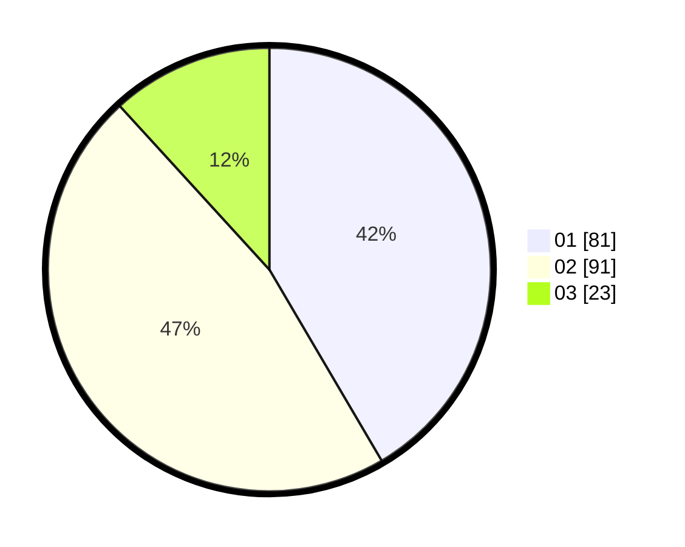

# Hasil

Hasil perolehan suara paslon dapat dilihat pada file paslon-01.txt, paslon-02.txt, dan paslon-03.txt.

Jika tidak ada, artinya data tersebut belum ada pada SIREKAP.

## Perolehan Suara

 * Paslon 01: **81**.
 * Paslon 02: **91**.
 * Paslon 03: **23**.

## Foto C Plano

https://sirekap-obj-formc.kpu.go.id/919e/pemilu/ppwp/31/71/08/10/01/3171081001101-20240216-144834--e17135fb-7fd7-4228-b84f-4344123b04aa.jpg

https://sirekap-obj-formc.kpu.go.id/919e/pemilu/ppwp/31/71/08/10/01/3171081001101-20240216-144835--82f77b0e-0da5-4f96-9876-12484af7dd79.jpg

https://sirekap-obj-formc.kpu.go.id/919e/pemilu/ppwp/31/71/08/10/01/3171081001101-20240216-144834--4ffc7c41-9c8f-4965-ae2b-d43123da8d29.jpg

## DATA PEMILIH TETAP

Jumlah pemilih dalam DPT: **237**.
 * L: **125**.
 * P: **112**.

## DATA PENGGUNA HAK PILIH

Jumlah pengguna hak pilih dalam DPT: **195**.
 * L: **103**.
 * P: **92**.

Jumlah pengguna hak pilih dalam DPTb: **0**.
 * L: **0**.
 * P: **0**.

Jumlah pengguna hak pilih dalam DPK: **1**.
 * L: **1**.
 * P: **0**.

Jumlah pengguna hak pilih: **196**.
 * L: **104**.
 * P: **92**.

## JUMLAH SUARA SAH DAN TIDAK SAH

JUMLAH SELURUH SUARA SAH: **195**.

JUMLAH SUARA TIDAK SAH: **3**.

JUMLAH SELURUH SUARA SAH DAN SUARA TIDAK SAH: **198**.
