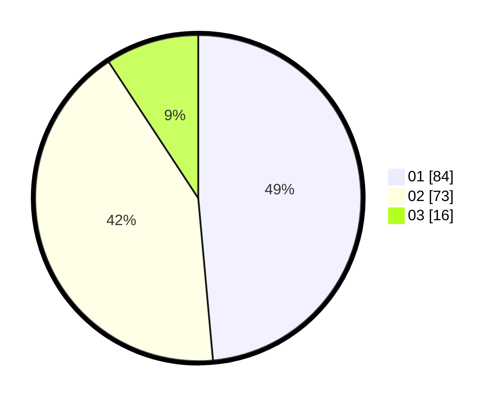

# Hasil

Hasil perolehan suara paslon dapat dilihat pada file paslon-01.txt, paslon-02.txt, dan paslon-03.txt.

Jika tidak ada, artinya data tersebut belum ada pada SIREKAP.

## Perolehan Suara

 * Paslon 01: **84**.
 * Paslon 02: **73**.
 * Paslon 03: **16**.

## Foto C Plano

https://sirekap-obj-formc.kpu.go.id/5425/pemilu/ppwp/31/71/08/10/01/3171081001103-20240216-150540--cbeff762-eae9-4c15-8bb8-9b673f723732.jpg

https://sirekap-obj-formc.kpu.go.id/5425/pemilu/ppwp/31/71/08/10/01/3171081001103-20240216-150541--05a05499-cad6-4e30-b8c4-08f52f4004e5.jpg

https://sirekap-obj-formc.kpu.go.id/5425/pemilu/ppwp/31/71/08/10/01/3171081001103-20240216-150540--2b7346cf-9161-46bf-bfe9-2218ef9e1860.jpg

## DATA PEMILIH TETAP

Jumlah pemilih dalam DPT: **229**.
 * L: **104**.
 * P: **125**.

## DATA PENGGUNA HAK PILIH

Jumlah pengguna hak pilih dalam DPT: **179**.
 * L: **78**.
 * P: **101**.

Jumlah pengguna hak pilih dalam DPTb: **0**.
 * L: **0**.
 * P: **0**.

Jumlah pengguna hak pilih dalam DPK: **2**.
 * L: **0**.
 * P: **2**.

Jumlah pengguna hak pilih: **181**.
 * L: **78**.
 * P: **103**.

## JUMLAH SUARA SAH DAN TIDAK SAH

JUMLAH SELURUH SUARA SAH: **173**.

JUMLAH SUARA TIDAK SAH: **8**.

JUMLAH SELURUH SUARA SAH DAN SUARA TIDAK SAH: **181**.
