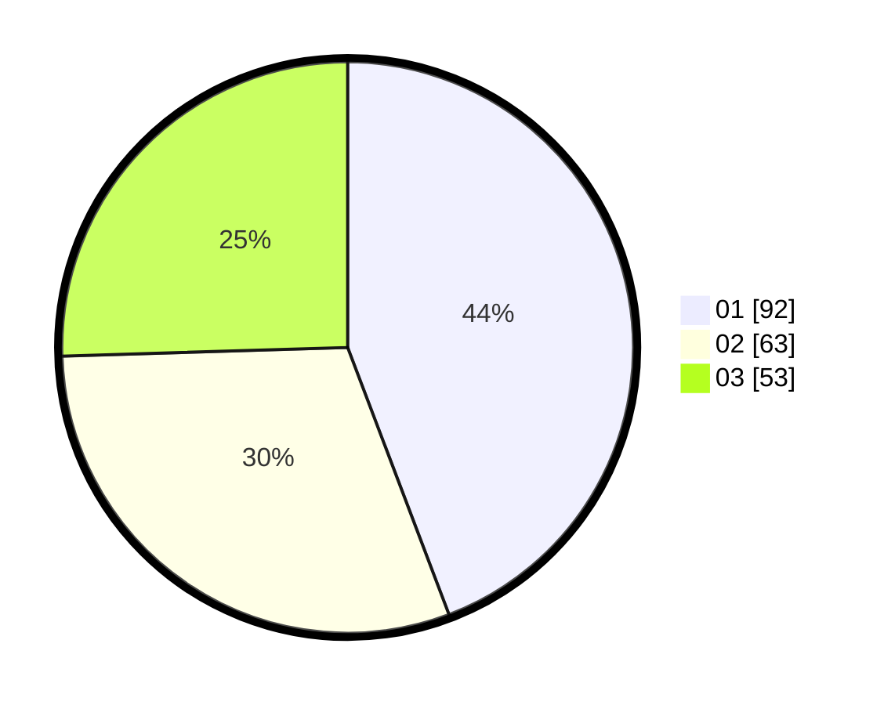

# Hasil

Hasil perolehan suara paslon dapat dilihat pada file paslon-01.txt, paslon-02.txt, dan paslon-03.txt.

Jika tidak ada, artinya data tersebut belum ada pada SIREKAP.

## Perolehan Suara

 * Paslon 01: **92**.
 * Paslon 02: **63**.
 * Paslon 03: **53**.

## Foto C Plano

https://sirekap-obj-formc.kpu.go.id/057e/pemilu/ppwp/31/71/08/10/01/3171081001105-20240215-071310--4bbadd61-7f08-4310-b7e6-43be01277e1e.jpg

https://sirekap-obj-formc.kpu.go.id/057e/pemilu/ppwp/31/71/08/10/01/3171081001105-20240215-071502--4e1abae6-6c86-47b1-96e7-f21463c2b569.jpg

https://sirekap-obj-formc.kpu.go.id/057e/pemilu/ppwp/31/71/08/10/01/3171081001105-20240215-071900--7ea7dc1d-9392-4ba7-8af4-9ed2065fb2ff.jpg

## DATA PEMILIH TETAP

Jumlah pemilih dalam DPT: **248**.
 * L: **113**.
 * P: **135**.

## DATA PENGGUNA HAK PILIH

Jumlah pengguna hak pilih dalam DPT: **197**.
 * L: **86**.
 * P: **111**.

Jumlah pengguna hak pilih dalam DPTb: **0**.
 * L: **0**.
 * P: **0**.

Jumlah pengguna hak pilih dalam DPK: **9**.
 * L: **3**.
 * P: **6**.

Jumlah pengguna hak pilih: **206**.
 * L: **89**.
 * P: **117**.

## JUMLAH SUARA SAH DAN TIDAK SAH

JUMLAH SELURUH SUARA SAH: **208**.

JUMLAH SUARA TIDAK SAH: **1**.

JUMLAH SELURUH SUARA SAH DAN SUARA TIDAK SAH: **209**.
