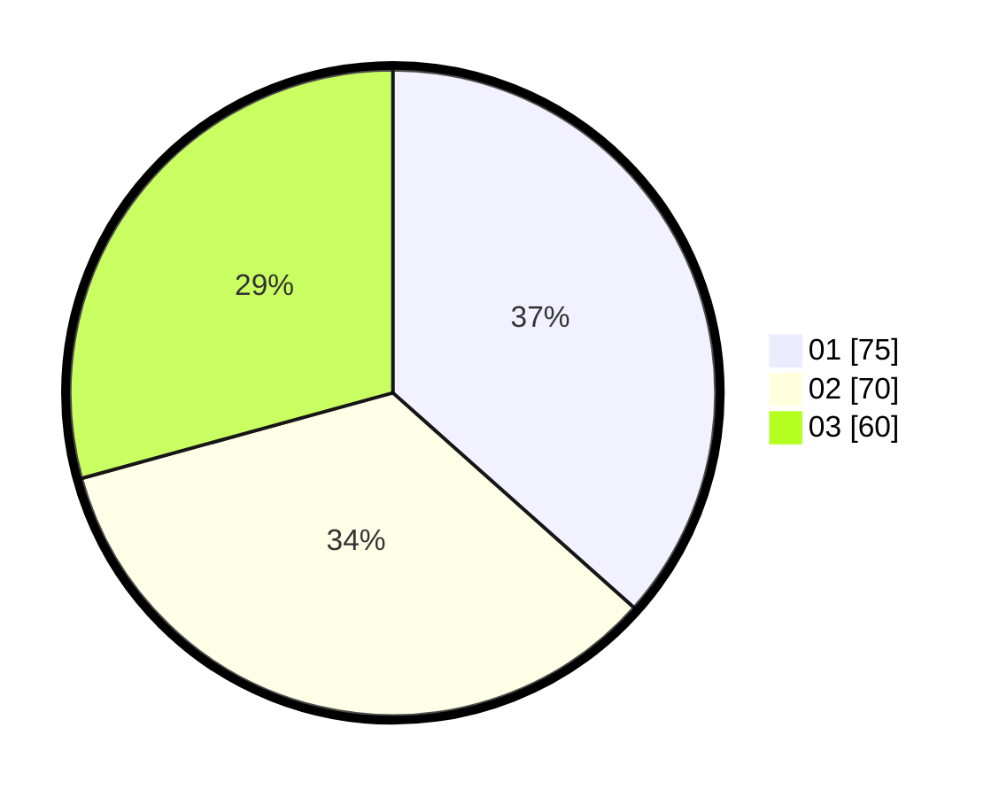

# Hasil

Hasil perolehan suara paslon dapat dilihat pada file paslon-01.txt, paslon-02.txt, dan paslon-03.txt.

Jika tidak ada, artinya data tersebut belum ada pada SIREKAP.

## Perolehan Suara

 * Paslon 01: **75**.
 * Paslon 02: **70**.
 * Paslon 03: **60**.

## Foto C Plano

https://sirekap-obj-formc.kpu.go.id/b96b/pemilu/ppwp/31/71/08/10/01/3171081001106-20240216-190430--6ad7b79a-5417-426d-bbee-04d460319e26.jpg

https://sirekap-obj-formc.kpu.go.id/b96b/pemilu/ppwp/31/71/08/10/01/3171081001106-20240216-190431--2d4ed884-1699-439c-a2fd-36b1fc691934.jpg

https://sirekap-obj-formc.kpu.go.id/b96b/pemilu/ppwp/31/71/08/10/01/3171081001106-20240216-190430--f1448f9d-1eb5-4c9b-96d5-3877b7e8a90f.jpg

## DATA PEMILIH TETAP

Jumlah pemilih dalam DPT: **255**.
 * L: **123**.
 * P: **132**.

## DATA PENGGUNA HAK PILIH

Jumlah pengguna hak pilih dalam DPT: **198**.
 * L: **92**.
 * P: **106**.

Jumlah pengguna hak pilih dalam DPTb: **9**.
 * L: **6**.
 * P: **3**.

Jumlah pengguna hak pilih dalam DPK: **1**.
 * L: **0**.
 * P: **1**.

Jumlah pengguna hak pilih: **208**.
 * L: **98**.
 * P: **110**.

## JUMLAH SUARA SAH DAN TIDAK SAH

JUMLAH SELURUH SUARA SAH: **205**.

JUMLAH SUARA TIDAK SAH: **3**.

JUMLAH SELURUH SUARA SAH DAN SUARA TIDAK SAH: **208**.
