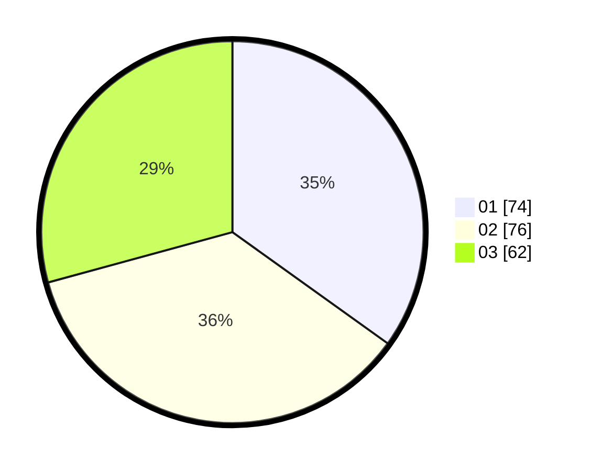

# Hasil

Hasil perolehan suara paslon dapat dilihat pada file paslon-01.txt, paslon-02.txt, dan paslon-03.txt.

Jika tidak ada, artinya data tersebut belum ada pada SIREKAP.

## Perolehan Suara

 * Paslon 01: **74**.
 * Paslon 02: **76**.
 * Paslon 03: **62**.

## Foto C Plano

https://sirekap-obj-formc.kpu.go.id/90f8/pemilu/ppwp/31/71/08/10/01/3171081001107-20240216-151926--22aab871-0147-44d0-82ef-e1e1630e6943.jpg

https://sirekap-obj-formc.kpu.go.id/90f8/pemilu/ppwp/31/71/08/10/01/3171081001107-20240216-151927--ab4a286d-a9fe-4e61-8e57-d70f786f0aba.jpg

https://sirekap-obj-formc.kpu.go.id/90f8/pemilu/ppwp/31/71/08/10/01/3171081001107-20240216-151927--c99fab82-fce1-4362-b6fd-98bd2fe726d6.jpg

## DATA PEMILIH TETAP

Jumlah pemilih dalam DPT: **268**.
 * L: **123**.
 * P: **145**.

## DATA PENGGUNA HAK PILIH

Jumlah pengguna hak pilih dalam DPT: **203**.
 * L: **88**.
 * P: **115**.

Jumlah pengguna hak pilih dalam DPTb: **6**.
 * L: **2**.
 * P: **4**.

Jumlah pengguna hak pilih dalam DPK: **4**.
 * L: **1**.
 * P: **3**.

Jumlah pengguna hak pilih: **213**.
 * L: **91**.
 * P: **122**.

## JUMLAH SUARA SAH DAN TIDAK SAH

JUMLAH SELURUH SUARA SAH: **212**.

JUMLAH SUARA TIDAK SAH: **1**.

JUMLAH SELURUH SUARA SAH DAN SUARA TIDAK SAH: **213**.
