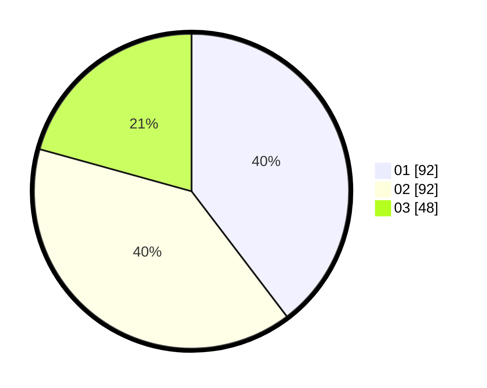

# Hasil

Hasil perolehan suara paslon dapat dilihat pada file paslon-01.txt, paslon-02.txt, dan paslon-03.txt.

Jika tidak ada, artinya data tersebut belum ada pada SIREKAP.

## Perolehan Suara

 * Paslon 01: **92**.
 * Paslon 02: **92**.
 * Paslon 03: **48**.

## Foto C Plano

https://sirekap-obj-formc.kpu.go.id/7c3c/pemilu/ppwp/31/71/08/10/01/3171081001109-20240216-153207--2ca3d024-b173-4ff6-bed5-b16d64cd8685.jpg

https://sirekap-obj-formc.kpu.go.id/7c3c/pemilu/ppwp/31/71/08/10/01/3171081001109-20240216-153208--1ea4fcd8-df7b-4f95-84d4-e3bb23a58b0e.jpg

https://sirekap-obj-formc.kpu.go.id/7c3c/pemilu/ppwp/31/71/08/10/01/3171081001109-20240216-153207--af2bf385-89e3-42fb-9479-a15378130bfa.jpg

## DATA PEMILIH TETAP

Jumlah pemilih dalam DPT: **275**.
 * L: **121**.
 * P: **154**.

## DATA PENGGUNA HAK PILIH

Jumlah pengguna hak pilih dalam DPT: **229**.
 * L: **100**.
 * P: **129**.

Jumlah pengguna hak pilih dalam DPTb: **4**.
 * L: **2**.
 * P: **2**.

Jumlah pengguna hak pilih dalam DPK: **2**.
 * L: **1**.
 * P: **1**.

Jumlah pengguna hak pilih: **235**.
 * L: **103**.
 * P: **132**.

## JUMLAH SUARA SAH DAN TIDAK SAH

JUMLAH SELURUH SUARA SAH: **232**.

JUMLAH SUARA TIDAK SAH: **3**.

JUMLAH SELURUH SUARA SAH DAN SUARA TIDAK SAH: **235**.
