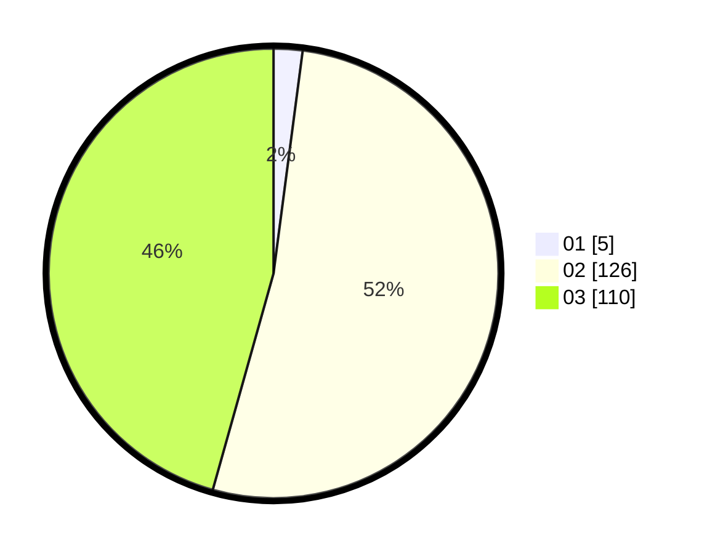

# Hasil

Hasil perolehan suara paslon dapat dilihat pada file paslon-01.txt, paslon-02.txt, dan paslon-03.txt.

Jika tidak ada, artinya data tersebut belum ada pada SIREKAP.

## Perolehan Suara

 * Paslon 01: **5**.
 * Paslon 02: **126**.
 * Paslon 03: **110**.

## Foto C Plano

https://sirekap-obj-formc.kpu.go.id/52d6/pemilu/ppwp/31/71/08/10/01/3171081001114-20240214-155036--0c926ec8-bc5d-4070-a3d8-429aea2a37d6.jpg

https://sirekap-obj-formc.kpu.go.id/52d6/pemilu/ppwp/31/71/08/10/01/3171081001114-20240214-155625--b3b5c325-0f4c-4f48-8758-efe7c48a645b.jpg

https://sirekap-obj-formc.kpu.go.id/52d6/pemilu/ppwp/31/71/08/10/01/3171081001114-20240216-163332--a1ae379d-6732-46fe-9d96-b4ae651063dd.jpg

## DATA PEMILIH TETAP

Jumlah pemilih dalam DPT: **283**.
 * L: **139**.
 * P: **144**.

## DATA PENGGUNA HAK PILIH

Jumlah pengguna hak pilih dalam DPT: **238**.
 * L: **113**.
 * P: **125**.

Jumlah pengguna hak pilih dalam DPTb: **1**.
 * L: **0**.
 * P: **1**.

Jumlah pengguna hak pilih dalam DPK: **2**.
 * L: **1**.
 * P: **1**.

Jumlah pengguna hak pilih: **241**.
 * L: **114**.
 * P: **127**.

## JUMLAH SUARA SAH DAN TIDAK SAH

JUMLAH SELURUH SUARA SAH: **241**.

JUMLAH SUARA TIDAK SAH: **6**.

JUMLAH SELURUH SUARA SAH DAN SUARA TIDAK SAH: **247**.
