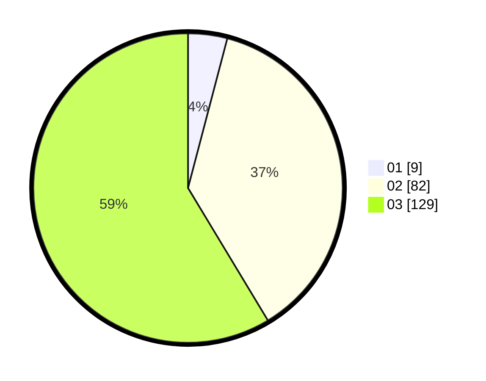

# Hasil

Hasil perolehan suara paslon dapat dilihat pada file paslon-01.txt, paslon-02.txt, dan paslon-03.txt.

Jika tidak ada, artinya data tersebut belum ada pada SIREKAP.

## Perolehan Suara

 * Paslon 01: **9**.
 * Paslon 02: **82**.
 * Paslon 03: **129**.

## Foto C Plano

https://sirekap-obj-formc.kpu.go.id/bd2a/pemilu/ppwp/31/71/08/10/01/3171081001115-20240216-160252--3ef79d65-b760-4c5e-aaf0-9cf60ebaa949.jpg

https://sirekap-obj-formc.kpu.go.id/bd2a/pemilu/ppwp/31/71/08/10/01/3171081001115-20240216-151714--ff991197-8399-4f6e-9f9d-701af5953379.jpg

https://sirekap-obj-formc.kpu.go.id/bd2a/pemilu/ppwp/31/71/08/10/01/3171081001115-20240216-151713--5398df71-a7b1-4682-acba-d7a7c749ae1e.jpg

## DATA PEMILIH TETAP

Jumlah pemilih dalam DPT: **265**.
 * L: **118**.
 * P: **147**.

## DATA PENGGUNA HAK PILIH

Jumlah pengguna hak pilih dalam DPT: **214**.
 * L: **94**.
 * P: **120**.

Jumlah pengguna hak pilih dalam DPTb: **8**.
 * L: **4**.
 * P: **4**.

Jumlah pengguna hak pilih dalam DPK: **0**.
 * L: **0**.
 * P: **0**.

Jumlah pengguna hak pilih: **222**.
 * L: **98**.
 * P: **124**.

## JUMLAH SUARA SAH DAN TIDAK SAH

JUMLAH SELURUH SUARA SAH: **220**.

JUMLAH SUARA TIDAK SAH: **2**.

JUMLAH SELURUH SUARA SAH DAN SUARA TIDAK SAH: **222**.
