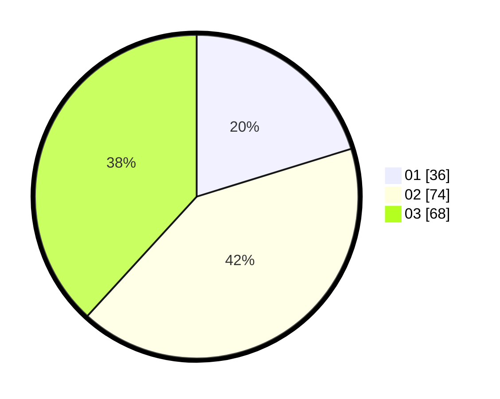

# Hasil

Hasil perolehan suara paslon dapat dilihat pada file paslon-01.txt, paslon-02.txt, dan paslon-03.txt.

Jika tidak ada, artinya data tersebut belum ada pada SIREKAP.

## Perolehan Suara

 * Paslon 01: **36**.
 * Paslon 02: **74**.
 * Paslon 03: **68**.

## Foto C Plano

https://sirekap-obj-formc.kpu.go.id/dc3c/pemilu/ppwp/31/71/08/10/01/3171081001117-20240216-151137--5e1e7abb-3631-44d5-ab3b-46bcb5c1e81b.jpg

https://sirekap-obj-formc.kpu.go.id/dc3c/pemilu/ppwp/31/71/08/10/01/3171081001117-20240216-151139--323b4305-7a17-4ac0-aa63-92cc4137c5c9.jpg

https://sirekap-obj-formc.kpu.go.id/dc3c/pemilu/ppwp/31/71/08/10/01/3171081001117-20240216-151138--2e440806-6df8-44c9-9080-b95832b2a603.jpg

## DATA PEMILIH TETAP

Jumlah pemilih dalam DPT: **231**.
 * L: **116**.
 * P: **115**.

## DATA PENGGUNA HAK PILIH

Jumlah pengguna hak pilih dalam DPT: **176**.
 * L: **91**.
 * P: **85**.

Jumlah pengguna hak pilih dalam DPTb: **2**.
 * L: **2**.
 * P: **0**.

Jumlah pengguna hak pilih dalam DPK: **2**.
 * L: **0**.
 * P: **2**.

Jumlah pengguna hak pilih: **180**.
 * L: **93**.
 * P: **87**.

## JUMLAH SUARA SAH DAN TIDAK SAH

JUMLAH SELURUH SUARA SAH: **178**.

JUMLAH SUARA TIDAK SAH: **2**.

JUMLAH SELURUH SUARA SAH DAN SUARA TIDAK SAH: **180**.
