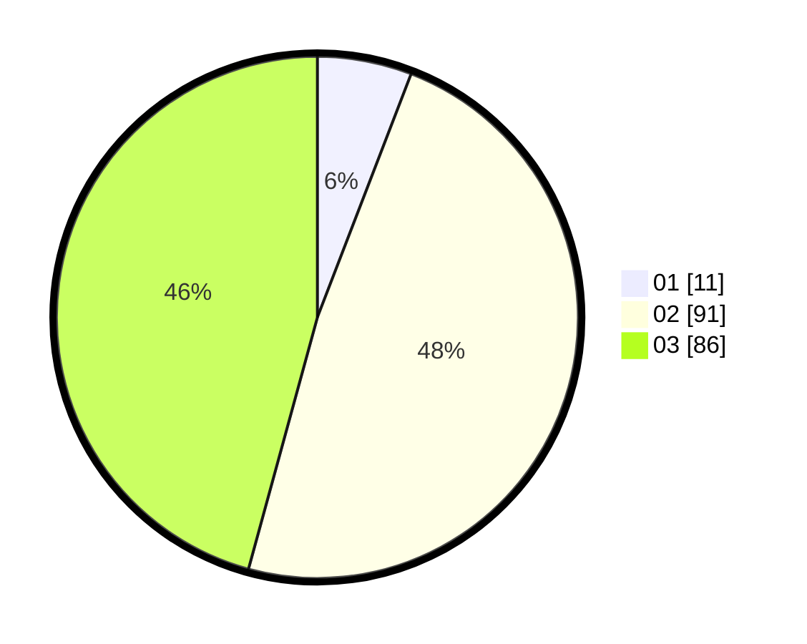

# Hasil

Hasil perolehan suara paslon dapat dilihat pada file paslon-01.txt, paslon-02.txt, dan paslon-03.txt.

Jika tidak ada, artinya data tersebut belum ada pada SIREKAP.

## Perolehan Suara

 * Paslon 01: **11**.
 * Paslon 02: **91**.
 * Paslon 03: **86**.

## Foto C Plano

https://sirekap-obj-formc.kpu.go.id/5237/pemilu/ppwp/31/71/08/10/01/3171081001118-20240216-160835--42a14c16-4041-4ee5-a170-bbc9de26344d.jpg

https://sirekap-obj-formc.kpu.go.id/5237/pemilu/ppwp/31/71/08/10/01/3171081001118-20240216-160837--3a11c1f3-5ebb-499f-873c-35d6c25c88af.jpg

https://sirekap-obj-formc.kpu.go.id/5237/pemilu/ppwp/31/71/08/10/01/3171081001118-20240216-160836--e3f3805c-b8d5-4bc7-b87c-7f86ef8c0431.jpg

## DATA PEMILIH TETAP

Jumlah pemilih dalam DPT: **270**.
 * L: **127**.
 * P: **143**.

## DATA PENGGUNA HAK PILIH

Jumlah pengguna hak pilih dalam DPT: **195**.
 * L: **87**.
 * P: **108**.

Jumlah pengguna hak pilih dalam DPTb: **0**.
 * L: **0**.
 * P: **0**.

Jumlah pengguna hak pilih dalam DPK: **0**.
 * L: **0**.
 * P: **0**.

Jumlah pengguna hak pilih: **195**.
 * L: **87**.
 * P: **108**.

## JUMLAH SUARA SAH DAN TIDAK SAH

JUMLAH SELURUH SUARA SAH: **188**.

JUMLAH SUARA TIDAK SAH: **7**.

JUMLAH SELURUH SUARA SAH DAN SUARA TIDAK SAH: **195**.
