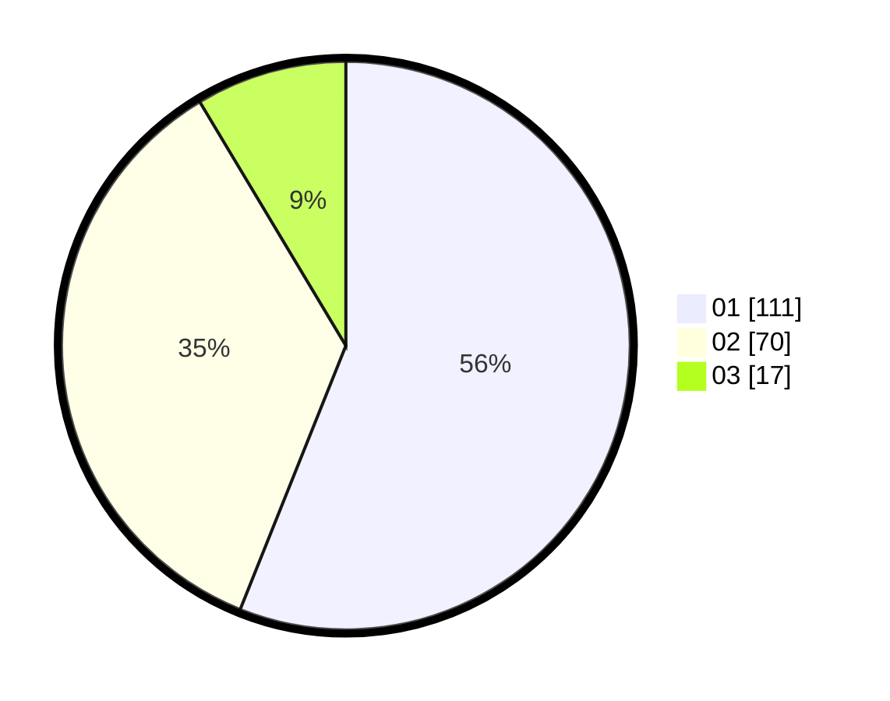

# Hasil

Hasil perolehan suara paslon dapat dilihat pada file paslon-01.txt, paslon-02.txt, dan paslon-03.txt.

Jika tidak ada, artinya data tersebut belum ada pada SIREKAP.

## Perolehan Suara

 * Paslon 01: **111**.
 * Paslon 02: **70**.
 * Paslon 03: **17**.

## Foto C Plano

https://sirekap-obj-formc.kpu.go.id/91da/pemilu/ppwp/31/71/08/10/01/3171081001123-20240216-144142--fdbf7d3d-a429-4614-87a9-976fe3b6602b.jpg

https://sirekap-obj-formc.kpu.go.id/91da/pemilu/ppwp/31/71/08/10/01/3171081001123-20240216-144143--1ade8636-a17e-469d-9daa-b48c5e0e8eb0.jpg

https://sirekap-obj-formc.kpu.go.id/91da/pemilu/ppwp/31/71/08/10/01/3171081001123-20240216-144142--3b014639-0284-47b6-a9e6-22fa63d73ac8.jpg

## DATA PEMILIH TETAP

Jumlah pemilih dalam DPT: **264**.
 * L: **127**.
 * P: **137**.

## DATA PENGGUNA HAK PILIH

Jumlah pengguna hak pilih dalam DPT: **200**.
 * L: **93**.
 * P: **107**.

Jumlah pengguna hak pilih dalam DPTb: **1**.
 * L: **1**.
 * P: **0**.

Jumlah pengguna hak pilih dalam DPK: **1**.
 * L: **1**.
 * P: **0**.

Jumlah pengguna hak pilih: **201**.
 * L: **94**.
 * P: **107**.

## JUMLAH SUARA SAH DAN TIDAK SAH

JUMLAH SELURUH SUARA SAH: **198**.

JUMLAH SUARA TIDAK SAH: **3**.

JUMLAH SELURUH SUARA SAH DAN SUARA TIDAK SAH: **201**.
