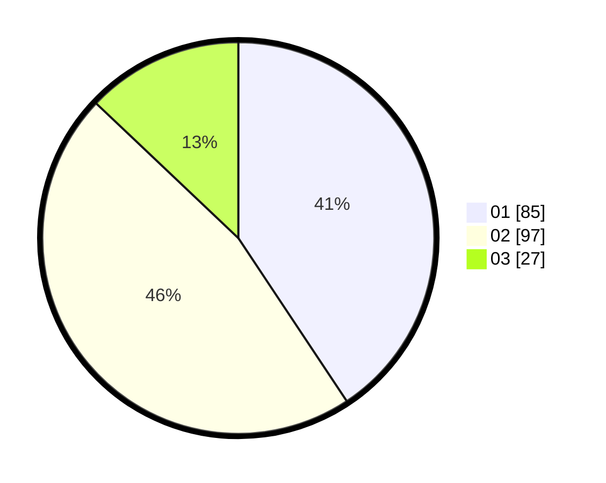

# Hasil

Hasil perolehan suara paslon dapat dilihat pada file paslon-01.txt, paslon-02.txt, dan paslon-03.txt.

Jika tidak ada, artinya data tersebut belum ada pada SIREKAP.

## Perolehan Suara

 * Paslon 01: **85**.
 * Paslon 02: **97**.
 * Paslon 03: **27**.

## Foto C Plano

https://sirekap-obj-formc.kpu.go.id/a19c/pemilu/ppwp/31/71/08/10/01/3171081001125-20240216-190419--f4df2c95-2b66-4564-8d2e-b898bf57713e.jpg

https://sirekap-obj-formc.kpu.go.id/a19c/pemilu/ppwp/31/71/08/10/01/3171081001125-20240216-190421--ad3e7fa7-0446-4c19-9c47-969700d1c32d.jpg

https://sirekap-obj-formc.kpu.go.id/a19c/pemilu/ppwp/31/71/08/10/01/3171081001125-20240216-190420--f8310639-e8e3-4232-8d6e-4c6c95efbe73.jpg

## DATA PEMILIH TETAP

Jumlah pemilih dalam DPT: **262**.
 * L: **133**.
 * P: **129**.

## DATA PENGGUNA HAK PILIH

Jumlah pengguna hak pilih dalam DPT: **203**.
 * L: **104**.
 * P: **99**.

Jumlah pengguna hak pilih dalam DPTb: **4**.
 * L: **1**.
 * P: **3**.

Jumlah pengguna hak pilih dalam DPK: **2**.
 * L: **1**.
 * P: **1**.

Jumlah pengguna hak pilih: **209**.
 * L: **106**.
 * P: **103**.

## JUMLAH SUARA SAH DAN TIDAK SAH

JUMLAH SELURUH SUARA SAH: **209**.

JUMLAH SUARA TIDAK SAH: **0**.

JUMLAH SELURUH SUARA SAH DAN SUARA TIDAK SAH: **209**.
