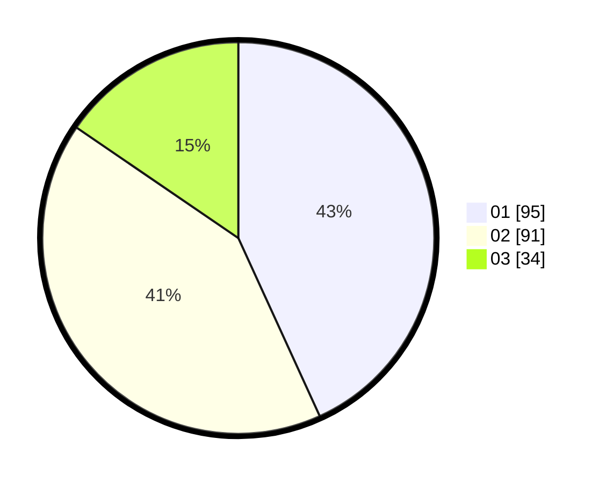

# Hasil

Hasil perolehan suara paslon dapat dilihat pada file paslon-01.txt, paslon-02.txt, dan paslon-03.txt.

Jika tidak ada, artinya data tersebut belum ada pada SIREKAP.

## Perolehan Suara

 * Paslon 01: **95**.
 * Paslon 02: **91**.
 * Paslon 03: **34**.

## Foto C Plano

https://sirekap-obj-formc.kpu.go.id/b4b1/pemilu/ppwp/31/71/08/10/02/3171081002001-20240215-004403--b8805d84-bcf3-4fe0-bf8a-d14d9308f25a.jpg

https://sirekap-obj-formc.kpu.go.id/b4b1/pemilu/ppwp/31/71/08/10/02/3171081002001-20240215-025645--1970bb5f-4134-4cdb-9abe-3546b378f488.jpg

https://sirekap-obj-formc.kpu.go.id/b4b1/pemilu/ppwp/31/71/08/10/02/3171081002001-20240215-025736--ce5a352d-e52c-4339-8434-e5f635d44f12.jpg
