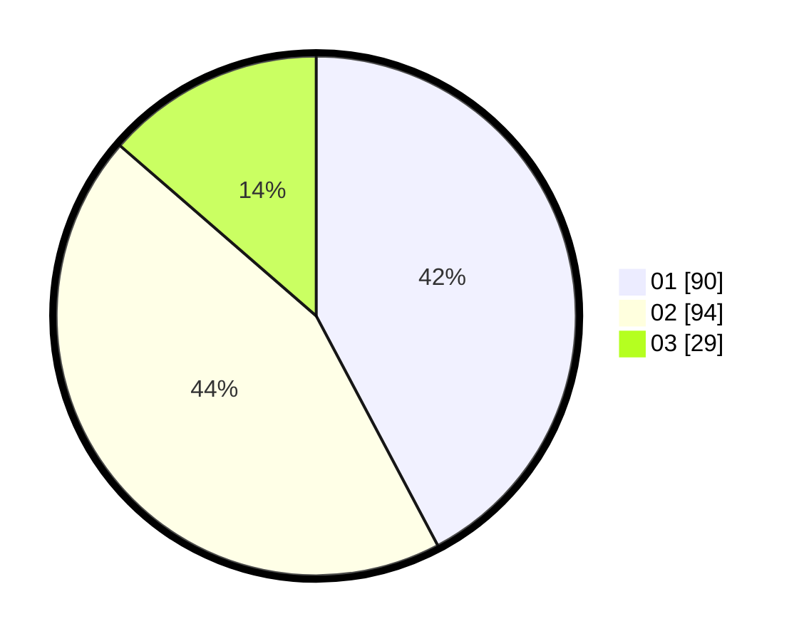

# Hasil

Hasil perolehan suara paslon dapat dilihat pada file paslon-01.txt, paslon-02.txt, dan paslon-03.txt.

Jika tidak ada, artinya data tersebut belum ada pada SIREKAP.

## Perolehan Suara

 * Paslon 01: **90**.
 * Paslon 02: **94**.
 * Paslon 03: **29**.

## Foto C Plano

https://sirekap-obj-formc.kpu.go.id/894c/pemilu/ppwp/31/71/08/10/02/3171081002003-20240214-155724--329baafb-4ee7-4bb0-b6fb-ad641a3b6914.jpg

https://sirekap-obj-formc.kpu.go.id/894c/pemilu/ppwp/31/71/08/10/02/3171081002003-20240214-155908--831b148e-288d-4509-8ba8-9f03f742ff03.jpg

https://sirekap-obj-formc.kpu.go.id/894c/pemilu/ppwp/31/71/08/10/02/3171081002003-20240214-160135--7a84c295-ef64-44ce-9aa3-b322882ee4ac.jpg

## DATA PEMILIH TETAP

Jumlah pemilih dalam DPT: **261**.
 * L: **136**.
 * P: **125**.

## DATA PENGGUNA HAK PILIH

Jumlah pengguna hak pilih dalam DPT: **206**.
 * L: **104**.
 * P: **102**.

Jumlah pengguna hak pilih dalam DPTb: **6**.
 * L: **3**.
 * P: **3**.

Jumlah pengguna hak pilih dalam DPK: **3**.
 * L: **2**.
 * P: **1**.

Jumlah pengguna hak pilih: **215**.
 * L: **109**.
 * P: **106**.

## JUMLAH SUARA SAH DAN TIDAK SAH

JUMLAH SELURUH SUARA SAH: **213**.

JUMLAH SUARA TIDAK SAH: **2**.

JUMLAH SELURUH SUARA SAH DAN SUARA TIDAK SAH: **215**.
