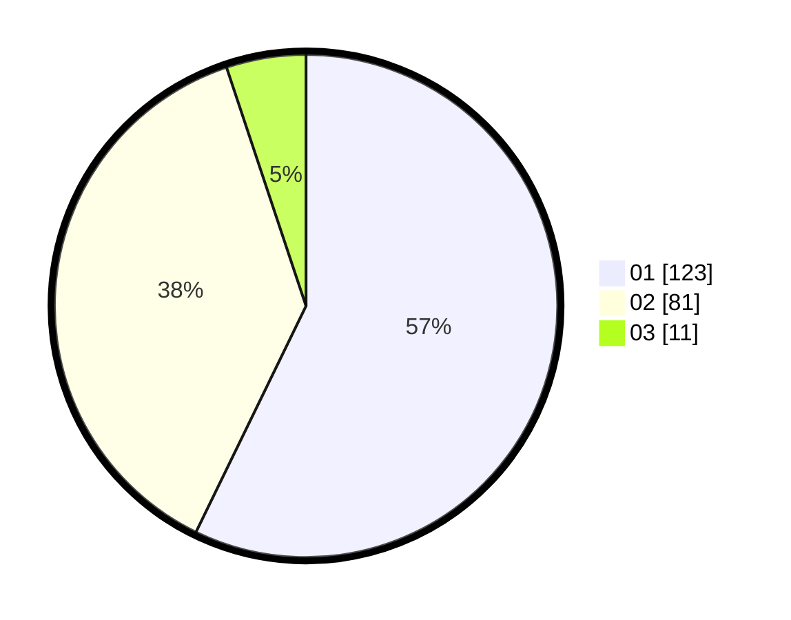

# Hasil

Hasil perolehan suara paslon dapat dilihat pada file paslon-01.txt, paslon-02.txt, dan paslon-03.txt.

Jika tidak ada, artinya data tersebut belum ada pada SIREKAP.

## Perolehan Suara

 * Paslon 01: **123**.
 * Paslon 02: **81**.
 * Paslon 03: **11**.

## Foto C Plano

https://sirekap-obj-formc.kpu.go.id/b739/pemilu/ppwp/31/71/08/10/02/3171081002004-20240216-041626--672ae36a-6c4f-4b3f-910c-bb44716383ec.jpg

https://sirekap-obj-formc.kpu.go.id/b739/pemilu/ppwp/31/71/08/10/02/3171081002004-20240216-041628--3867f74f-fb87-4f70-9f9f-995186187d07.jpg

https://sirekap-obj-formc.kpu.go.id/b739/pemilu/ppwp/31/71/08/10/02/3171081002004-20240216-041627--01ded734-5b68-4564-8f8a-efcea8c60547.jpg

## DATA PEMILIH TETAP

Jumlah pemilih dalam DPT: **216**.
 * L: **109**.
 * P: **107**.

## DATA PENGGUNA HAK PILIH

Jumlah pengguna hak pilih dalam DPT: **282**.
 * L: **143**.
 * P: **139**.

Jumlah pengguna hak pilih dalam DPTb: **0**.
 * L: **0**.
 * P: **0**.

Jumlah pengguna hak pilih dalam DPK: **1**.
 * L: **0**.
 * P: **1**.

Jumlah pengguna hak pilih: **283**.
 * L: **143**.
 * P: **140**.

## JUMLAH SUARA SAH DAN TIDAK SAH

JUMLAH SELURUH SUARA SAH: **215**.

JUMLAH SUARA TIDAK SAH: **2**.

JUMLAH SELURUH SUARA SAH DAN SUARA TIDAK SAH: **217**.
